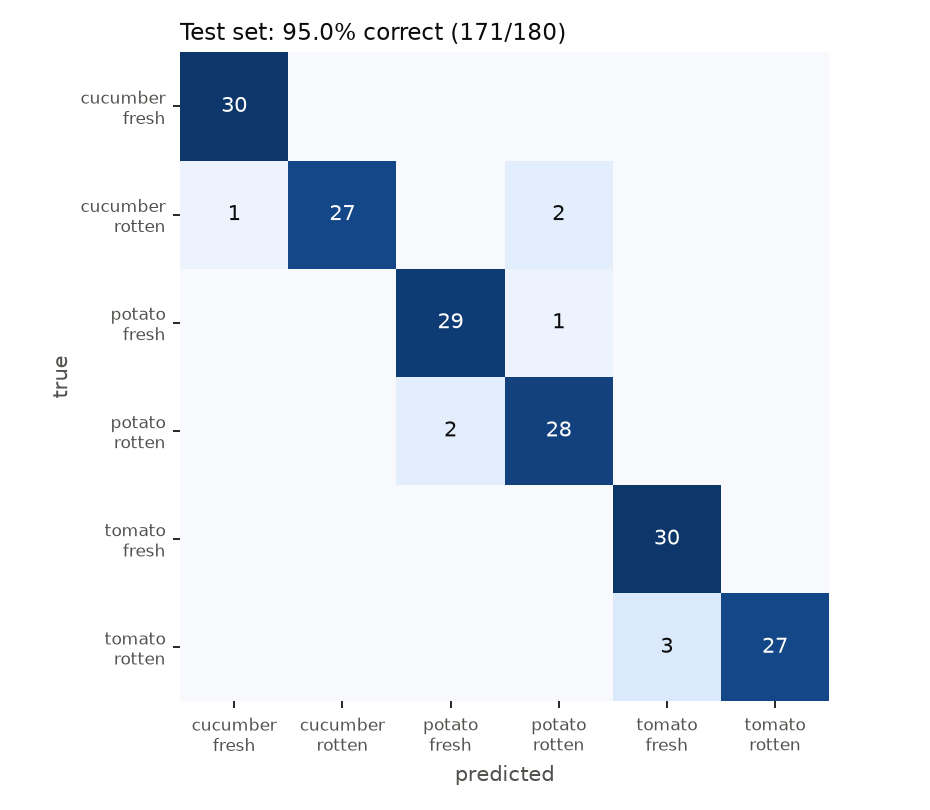

# 채소 종류·신선도 분류 (2차)

1. **1차:** 사진 한 장으로 채소 종류(오이·감자·토마토)와 정상/비정상을 맞히는 6개 클래스 모델을, Kaggle 사진 600장(Test 없음)과 ResNet18(마지막 층만 학습)으로 만들었다.
2. **데이터:** 교수님 상담에 따라 Kaggle 데이터 2개에서 1,200장으로 늘리고, Train 840 / Valid 180 / Test 180으로 나눠 모든 분할에서 정상:비정상을 5:5로 맞췄다.
3. **모델:** "모델 변경 필요" 의견에 따라 EfficientNet-B0 전체 미세조정과 데이터 증강으로 바꿨다.
4. **현재:** 학습에 쓰지 않은 Test 180장에서 6개 클래스 95.0%(171/180)를 맞힌다. 일부만 상한 채소를 더 잘 잡으려는 추가 실험은 기준을 넘지 못해 채택하지 않았다.

## 교수님 상담 반영

### 2026.9.23

- **dataset 수집 서두르기:** 완료.
    - 1차 600장(Kaggle 1개)에서 2차 1,200장(Kaggle 2개)으로 늘렸다.
    - 한 장씩 눈으로 검수했고, 같은 사진의 복사본이 여러 분할에 들어가지 않게 걸러냈다.

### 2026.9.30

- **model 변경 필요:** ResNet18(마지막 층만 학습)에서 EfficientNet-B0(전체 미세조정 + 데이터 증강)으로 바꿨다. 같은 Test 180장에서 6개 클래스 정확도가 87.2%에서 95.0%로 올랐다.
- 
- **dataset 구성:** Train·Valid·Test로 나누고, 모든 분할에서 P(정상):N(비정상)을 5:5로 맞췄다. 사진 폴더도 이 표와 같은 모양으로 나눴다.

| | Train | Valid | Test | 합계 |
|---|---:|---:|---:|---:|
| **P** (정상, Fresh) | 420 | 90 | 90 | 600 |
| **N** (비정상, Rotten) | 420 | 90 | 90 | 600 |
| **합계** | **840** | **180** | **180** | **1,200** |

```
dataset/
├── train/   P_fresh/ 420장   N_rotten/ 420장
├── valid/   P_fresh/  90장   N_rotten/  90장
└── test/    P_fresh/  90장   N_rotten/  90장
```

- **Train:** 모델 가중치를 학습한다.
- **Valid:** 학습 중 가장 좋은 epoch를 고른다.
- **Test:** 모델을 다 고른 뒤 마지막에 한 번만 채점한다.

## 1차와 달라진 점

| 항목 | 1차 | 2차 |
|---|---|---|
| 데이터 | 600장 (Train 480 / Valid 120 / Test 0) | 1,200장 (Train 840 / Valid 180 / Test 180) |
| 정상:비정상 | 5:5 | 모든 분할에서 5:5 |
| 출처 | Kaggle 1개 | Kaggle 2개 (두 번째는 오이 60장) |
| 중복 검사 | 해시 + 눈 검수 | 해시 + 반전·회전 불변 특징 + ORB 특징점 매칭 + 눈 검수 |
| 모델 | ResNet18, 마지막 층만 학습 (3,078개 파라미터) | EfficientNet-B0, 전체 미세조정 (402만 개 파라미터) |
| 데이터 증강 | 없음 | 무작위 자르기·반전·회전·색 변화 |
| 성능 보고 | 모델 선택에 쓴 Valid 점수 | 따로 떼어 둔 Test 점수 (마지막에 한 번만 채점) |

## 데이터셋

구성표는 위 [교수님 상담 반영](#교수님-상담-반영)에 있다. 채소마다 P·N 각각 Train 140 / Valid 30 / Test 30장이고, 채소 종류는 파일 이름 앞부분(예: `tomato_rotten_1201.jpg`)에 있다. 출처, 검수 기준, 같은 사진이 분할 사이에 섞이지 않게 한 방법은 [dataset/README.md](dataset/README.md)에 정리했다.

## 결과 (현재 모델)

현재 모델은 `model.pth`(EfficientNet-B0 전체 미세조정)다. 23 epoch까지 학습했고, Valid 점수로 15번째 epoch를 골랐다. Test는 마지막에 한 번만 채점했다.

| 항목 | Valid 180장 | Test 180장 |
|---|---:|---:|
| 6개 클래스 | 92.2% (166) | **95.0% (171)** |
| 채소 종류 | 97.8% (176) | 98.9% (178) |
| 정상/비정상 | 95.0% (171) | 96.7% (174) |
| 비정상 검출률 | 97.8% (88/90) | 94.4% (85/90) |
| 정상 정답률 | 92.2% (83/90) | 98.9% (89/90) |

- **비정상 검출률:** 비정상 사진 90장 중 비정상으로 맞힌 비율
- **정상 정답률:** 정상 사진 90장 중 정상으로 맞힌 비율
- **오차 범위:** Test가 180장이라 한 장이 0.56%p다. Test 6개 클래스 95.0%의 95% 신뢰구간은 90.8–97.3%다.

Test에서 클래스별로 맞힌 수는 다음과 같다.

| 채소 | 정상 | 비정상 |
|---|---:|---:|
| 오이 | 30/30 | 27/30 |
| 감자 | 29/30 | 28/30 |
| 토마토 | 30/30 | 27/30 |



- **틀린 9장의 유형:**
    - 덩굴에 달린 채 썩은 토마토, 작은 곰팡이 반점 토마토, 싹이 조금 난 감자처럼 이상이 작거나 초기인 사진
    - 감자처럼 보이는 갈색 오이
    - 이 중 3장은 점수가 0.5보다 낮아서 `predict.py`가 `uncertain`으로 표시한다. Test 전체에서 `uncertain`으로 표시되는 사진은 10장(오답 3, 정답 7)이다.
- **워터마크 영향:** Test 정상 사진 90장에 가짜 스톡 사진 워터마크 띠를 붙여도, 비정상으로 잘못 본 사진은 1장에서 2장으로 거의 그대로였다.
- **Grad-CAM 예시:** `results/efficientnet_b0_finetune/gradcam_examples/`에 있다. 덩굴 토마토 오답에서는 모델이 썩은 토마토가 아니라 앞쪽의 멀쩡한 토마토를 보고 판단했다.
- **학습 시간:** CPU 4코어에서 약 32분 걸렸다. 학습 중 다른 작업과 CPU를 함께 써서 실제보다 길게 나왔다.

## 내 사진으로 예측하기

Python 3.11~3.12, PyTorch 2.8.0 CPU 환경에서 확인했다.

```bash
python -m pip install torch==2.8.0 torchvision==0.23.0 --index-url https://download.pytorch.org/whl/cpu
python -m pip install "Pillow>=10.0,<12.0" "numpy>=1.26,<3.0" matplotlib
python src/predict.py --model model.pth --input my_photos --output results.csv
```

`my_photos` 폴더에 JPG·PNG 사진을 넣는다. 결과 CSV의 `predicted_class`가 예측이다.
- `cucumber`=오이, `potato`=감자, `tomato`=토마토이고, `fresh`=정상, `rotten`=비정상이다.
- 가장 높은 점수가 0.5보다 낮으면 `uncertain=yes`로 표시한다. 기준은 `--uncertain-below`로 바꿀 수 있다.
- 점수는 보정되지 않은 softmax 값이라 정답 확률로 볼 수 없다.
- 오이·감자·토마토가 아닌 사진도 6개 중 하나로 답한다.

## 다시 학습하기

```bash
# 최종 모델 (EfficientNet-B0 미세조정)
python src/train.py --manifest dataset/manifest.csv --out results/efficientnet_b0_finetune --arch efficientnet_b0 --mode finetune --epochs 30 --patience 8
# 비교용: ResNet18 미세조정
python src/train.py --manifest dataset/manifest.csv --out results/resnet18_finetune --arch resnet18 --mode finetune --epochs 30 --patience 8
# 비교용: 1차 방식 (ResNet18 마지막 층만, 증강 없음)
python src/train.py --manifest dataset/manifest.csv --out results/resnet18_linear --arch resnet18 --mode linear --no-augment --lr 0.005 --batch-size 16 --label-smoothing 0 --epochs 100 --patience 15
# 그래프
python src/make_plots.py
```

명령은 모두 저장소 맨 위 폴더에서 실행한다. 처음 실행하면 ImageNet 사전학습 가중치를 내려받는다. GPU가 있으면 `--device cuda`를 붙인다. 설정은 Valid 결과만 보고 바꾸고, Test 결과를 보고 설정을 다시 고치지 않는다.

## 파일 구성

```
depp-env22/
├── README.md
├── 학습결과_확인.ipynb      결과를 훑어보는 노트북
├── model.pth                최종 모델 (EfficientNet-B0) 가중치와 클래스·전처리·성능 정보
├── requirements.txt         필요한 파이썬 패키지
├── dataset/                 사진 1,200장과 데이터셋 설명
│   ├── train/ valid/ test/  각각 P_fresh/(정상), N_rotten/(비정상)
│   ├── manifest.csv         사진마다 분할·클래스·그룹·출처·해시
│   ├── README.md            출처, 검수 기준, 중복 검사 방법, 다시 만드는 방법
│   ├── summary.json         클래스·분할별 수량과 출처 정보
│   ├── review/              눈 검수 기록 (1차, 2차)
│   └── tools/               두 Kaggle 원본으로 dataset/을 다시 만드는 스크립트
├── src/
│   ├── train.py             학습
│   ├── predict.py           내 사진 예측
│   ├── model_utils.py       공통 함수 (모델 불러오기, 전처리, 클래스 이름)
│   ├── make_plots.py        학습 곡선, 혼동행렬, 모델 비교 그래프
│   └── gradcam.py           모델이 사진의 어느 부분을 보고 판단했는지 보여주는 그림
├── results/                 실험별 metrics.json, history.csv, val/test_predictions.csv, 그래프
│   └── round1_v1_data/      1차 모델의 학습 기록 (1차 가중치는 커밋 03db425에 있음)
└── experiments/             채택하지 않은 추가 실험 기록 (field_tomato, partial_rot)
```

가중치는 용량 때문에 최종 모델(`model.pth`)만 올렸다.

## 한계

- Test도 인터넷 사진이다. 직접 찍은 사진에서의 성능은 아직 측정하지 않았다.
- Valid·Test가 각 180장이라 한 장이 0.56%p다. 95% 신뢰구간 폭이 약 ±3~4%p이므로 1~2%p 차이는 의미 있게 보기 어렵다.
- 오이·감자·토마토가 아닌 사진도 6개 중 하나로 답한다.
- 개체 ID가 없어서, 같은 채소를 다른 각도로 찍은 사진이 서로 다른 분할에 들어갔을 가능성은 남아 있다. 같은 사진의 복사본은 막았다.
- 토마토 정상 Train 140장 중 83장이 두 촬영 세션에서 왔다.
- 비정상의 세부 유형(부패·싹·상처)은 구분하지 않는다.
- 꼭지 둘레만 곰팡이가 핀 토마토(몸통은 멀쩡함)를 정상으로 판단한다. 밭 토마토 사진 120장을 더해 다시 학습해 봤지만 이 유형은 고쳐지지 않았고, Test가 1장 떨어져 채택하지 않았다([experiments/field_tomato](experiments/field_tomato/README.md)).
- 일부만 상한 채소를 더 잘 잡으려고 입력 크기, 풀링, 부분 부패 사진 추가 등 10가지 후보를 시험했다. 어느 것도 미리 정한 기준을 넘지 못해 채택하지 않았다([experiments/partial_rot](experiments/partial_rot/README.md)).

## 참고

- [Fruits and Vegetables Dataset](https://www.kaggle.com/datasets/muhriddinmuxiddinov/fruits-and-vegetables-dataset) (CC0)
- [Fresh and Rotten Classification](https://www.kaggle.com/datasets/swoyam2609/fresh-and-stale-classification) (CDLA-Permissive 1.0)
- [PyTorch 전이학습 공식 안내](https://docs.pytorch.org/tutorials/beginner/transfer_learning_tutorial.html)
- [torchvision 사전학습 모델 목록](https://docs.pytorch.org/vision/stable/models.html)
