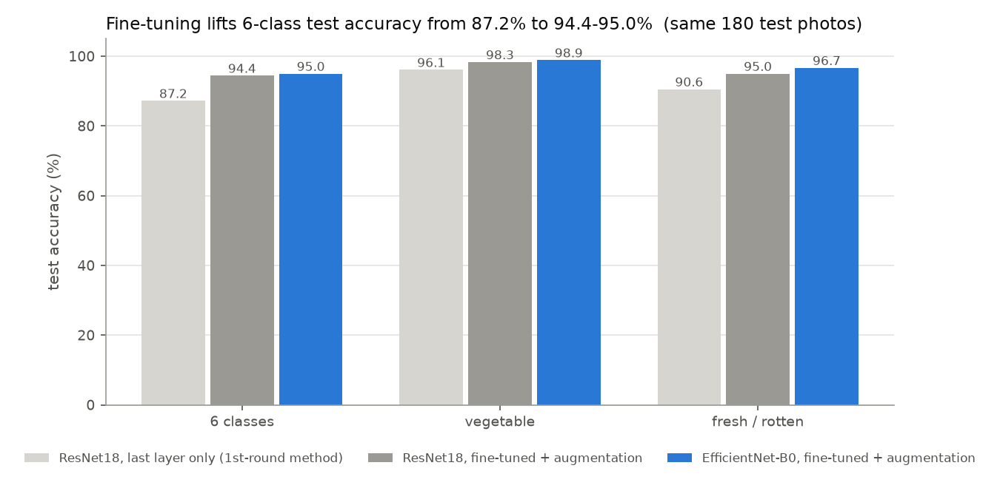

# 채소 종류·신선도 분류 (2차)

사진 한 장을 보고 채소 종류(오이·감자·토마토)와 상태(정상·비정상)를 함께 맞히는 6개 클래스 분류 모델이다. 2차에서는 데이터셋을 1,200장으로 늘려 Train/Valid/Test로 나눴고, 모델을 ResNet18(마지막 층만 학습)에서 EfficientNet-B0(전체 미세조정)으로 바꿨다.

최종 모델(EfficientNet-B0)은 따로 떼어 둔 Test 180장에서 6개 클래스 95.0%(171/180), 채소 종류 98.9%, 정상/비정상 96.7%를 맞혔다. 1차 방식으로 같은 데이터를 학습하면 87.2%이므로, 향상의 대부분은 본체까지 미세조정하고 데이터를 증강한 데서 나왔다.

## 1차와 달라진 점

| 항목 | 1차 | 2차 |
|---|---|---|
| 데이터 | 600장 (Train 480 / Valid 120 / Test 0) | 1,200장 (Train 840 / Valid 180 / Test 180) |
| 정상:비정상 | 5:5 | 모든 분할에서 5:5 |
| 출처 | Kaggle 1개 | Kaggle 2개 (두 번째는 오이 60장) |
| 중복 검사 | 해시 + 눈 검수 | 해시 + 반전·회전 불변 특징 + ORB 특징점 매칭 + 눈 검수 |
| 모델 | ResNet18, 마지막 층만 학습 (3,078개 파라미터) | EfficientNet-B0, 전체 미세조정 (402만 개 파라미터) |
| 데이터 증강 | 없음 | 무작위 자르기·반전·회전·색 변화 |
| 성능 보고 | 모델 선택에 쓴 Valid 점수 | 따로 떼어 둔 Test 점수 (마지막에 한 번만 채점) |

## 데이터셋

| 구분 | Train | Valid | Test | 합계 |
|---|---:|---:|---:|---:|
| 정상 (Fresh) | 420 | 90 | 90 | 600 |
| 비정상 (Rotten) | 420 | 90 | 90 | 600 |
| **합계** | **840** | **180** | **180** | **1,200** |

채소마다 정상·비정상 각각 Train 140 / Valid 30 / Test 30장이다. 출처, 검수 기준, 같은 사진이 분할 사이에 섞이지 않게 한 방법은 [DATA_USED.md](DATA_USED.md)에 정리했다.

## 결과

같은 Test 180장으로 세 가지 학습 방식을 비교했다. 어느 epoch를 쓸지는 Valid로만 골랐고, Test는 마지막에 한 번만 채점했다.

| 모델 | 학습 파라미터 | Valid 6클래스 | Test 6클래스 (95% 신뢰구간) | Test 채소 종류 | Test 정상/비정상 | 비정상 검출률 | 정상 정답률 |
|---|---:|---:|---:|---:|---:|---:|---:|
| 1차 방식: ResNet18 마지막 층만 | 3,078 | 88.9% | 87.2% (81.6–91.3) | 96.1% | 90.6% | 85.6% | 95.6% |
| ResNet18 미세조정 + 증강 | 1,118만 | 92.8% | 94.4% (90.1–97.0) | 98.3% | 95.0% | 92.2% | 97.8% |
| **EfficientNet-B0 미세조정 + 증강 (최종)** | 402만 | 92.2% | **95.0% (90.8–97.3)** | 98.9% | 96.7% | 94.4% | 98.9% |

- **비정상 검출률:** 비정상 사진 90장 중 비정상으로 맞힌 비율
- **정상 정답률:** 정상 사진 90장 중 정상으로 맞힌 비율



- **미세조정 효과:** 미세조정한 두 모델은 1차 방식보다 확실히 낫다. 같은 Test 사진으로 McNemar 검정을 하면 p = 0.003(EfficientNet-B0), p = 0.007(ResNet18)이다.
- **두 미세조정 모델의 차이:** EfficientNet-B0과 ResNet18의 차이는 Test 1장(171 대 170), Valid 1장으로 통계적으로 같다(p = 1.0).
    - 최종 모델은 학습 전에 정한 계획대로 EfficientNet-B0로 했다. 파라미터가 ResNet18의 약 3분의 1이라 더 가볍다.
    - "모델이 오래돼서 안 된다"는 문제는 구조보다 학습 방식(본체 고정, 증강 없음)의 영향이 컸다.
- **워터마크 영향:** Test 정상 사진 90장에 가짜 스톡 사진 워터마크 띠를 붙여 봤다.
    - 1차 방식은 비정상으로 잘못 본 사진이 4장에서 12장으로 늘었다.
    - EfficientNet-B0은 1장에서 2장으로 거의 그대로였다.
- **틀린 9장의 유형:**
    - 덩굴에 달린 채 썩은 토마토, 작은 곰팡이 반점 토마토, 싹이 조금 난 감자처럼 이상이 작거나 초기인 사진
    - 감자처럼 보이는 갈색 오이
    - 이 중 3장은 점수가 0.5보다 낮아서 `predict.py`가 `uncertain`으로 표시한다. Test 전체에서 `uncertain`으로 표시되는 사진은 10장(오답 3, 정답 7)이다.
- **Grad-CAM 예시:** `runs/efficientnet_b0_finetune/gradcam_examples/`에 있다. 덩굴 토마토 오답에서는 모델이 썩은 토마토가 아니라 앞쪽의 멀쩡한 토마토를 보고 판단했다.
- **학습 시간 (CPU 4코어):** 1차 방식 1.4분, ResNet18 미세조정 18분, EfficientNet-B0 미세조정 32분이다. EfficientNet-B0은 학습 중 다른 작업과 CPU를 함께 써서 실제보다 길게 나왔다.

## 내 사진으로 예측하기

Python 3.11~3.12, PyTorch 2.8.0 CPU 환경에서 확인했다.

```bash
python -m pip install torch==2.8.0 torchvision==0.23.0 --index-url https://download.pytorch.org/whl/cpu
python -m pip install "Pillow>=10.0,<12.0" "numpy>=1.26,<3.0" matplotlib
python predict.py --model model.pth --input my_photos --output results.csv
```

`my_photos` 폴더에 JPG·PNG 사진을 넣는다. 결과 CSV의 `predicted_class`가 예측이다.
- `cucumber`=오이, `potato`=감자, `tomato`=토마토이고, `fresh`=정상, `rotten`=비정상이다.
- 가장 높은 점수가 0.5보다 낮으면 `uncertain=yes`로 표시한다. 기준은 `--uncertain-below`로 바꿀 수 있다.
- 점수는 보정되지 않은 softmax 값이라 정답 확률로 볼 수 없다.
- 오이·감자·토마토가 아닌 사진도 6개 중 하나로 답한다.

## 다시 학습하기

```bash
# 최종 모델 (EfficientNet-B0 미세조정)
python train.py --manifest manifest.csv --out runs/efficientnet_b0_finetune --arch efficientnet_b0 --mode finetune --epochs 30 --patience 8
# 비교용: ResNet18 미세조정
python train.py --manifest manifest.csv --out runs/resnet18_finetune --arch resnet18 --mode finetune --epochs 30 --patience 8
# 비교용: 1차 방식 (ResNet18 마지막 층만, 증강 없음)
python train.py --manifest manifest.csv --out runs/resnet18_linear --arch resnet18 --mode linear --no-augment --lr 0.005 --batch-size 16 --label-smoothing 0 --epochs 100 --patience 15
# 그래프
python make_plots.py
```

처음 실행하면 ImageNet 사전학습 가중치를 내려받는다. GPU가 있으면 `--device cuda`를 붙인다. 설정은 Valid 결과만 보고 바꾸고, Test 결과를 보고 설정을 다시 고치지 않는다.

## 파일 구성

- `model.pth`: 최종 모델 (EfficientNet-B0) 가중치와 클래스·전처리·성능 정보
- `train.py`, `model_utils.py`, `predict.py`: 학습, 공통 함수, 예측
- `make_plots.py`: 학습 곡선, 혼동행렬, 모델 비교 그래프
- `gradcam.py`: 모델이 사진의 어느 부분을 보고 판단했는지 보여주는 Grad-CAM 그림
- `manifest.csv`: 사진 1,200장의 분할·그룹·출처·해시
- `images/`: 사진 원본 (클래스별 폴더)
- `runs/<실험>/`: 실험별 `metrics.json`, `history.csv`, `val/test_predictions.csv`, 그래프 (가중치는 용량 때문에 최종 모델만 올림)
- `runs/round1_v1_data/`: 1차 모델의 학습 기록 (1차 가중치는 커밋 `03db425`에 있음)
- `DATA_USED.md`, `data_counts.csv`, `data_summary.json`, `data_review/`: 데이터셋 설명과 검수 기록
- `dataset_tools/`: 두 Kaggle 원본으로 데이터셋을 다시 만드는 스크립트
- `학습결과_확인.ipynb`: 결과를 훑어보는 노트북

## 한계

- Test도 인터넷 사진이다. 직접 찍은 사진에서의 성능은 아직 측정하지 않았다.
- Valid·Test가 각 180장이라 한 장이 0.56%p다. 95% 신뢰구간 폭이 약 ±3~4%p이므로 1~2%p 차이는 의미 있게 보기 어렵다.
- 오이·감자·토마토가 아닌 사진도 6개 중 하나로 답한다.
- 개체 ID가 없어서, 같은 채소를 다른 각도로 찍은 사진이 서로 다른 분할에 들어갔을 가능성은 남아 있다. 같은 사진의 복사본은 막았다.
- 토마토 정상 Train 140장 중 83장이 두 촬영 세션에서 왔다.
- 비정상의 세부 유형(부패·싹·상처)은 구분하지 않는다.

## 참고

- [Fruits and Vegetables Dataset](https://www.kaggle.com/datasets/muhriddinmuxiddinov/fruits-and-vegetables-dataset) (CC0)
- [Fresh and Rotten Classification](https://www.kaggle.com/datasets/swoyam2609/fresh-and-stale-classification) (CDLA-Permissive 1.0)
- [PyTorch 전이학습 공식 안내](https://docs.pytorch.org/tutorials/beginner/transfer_learning_tutorial.html)
- [torchvision 사전학습 모델 목록](https://docs.pytorch.org/vision/stable/models.html)
