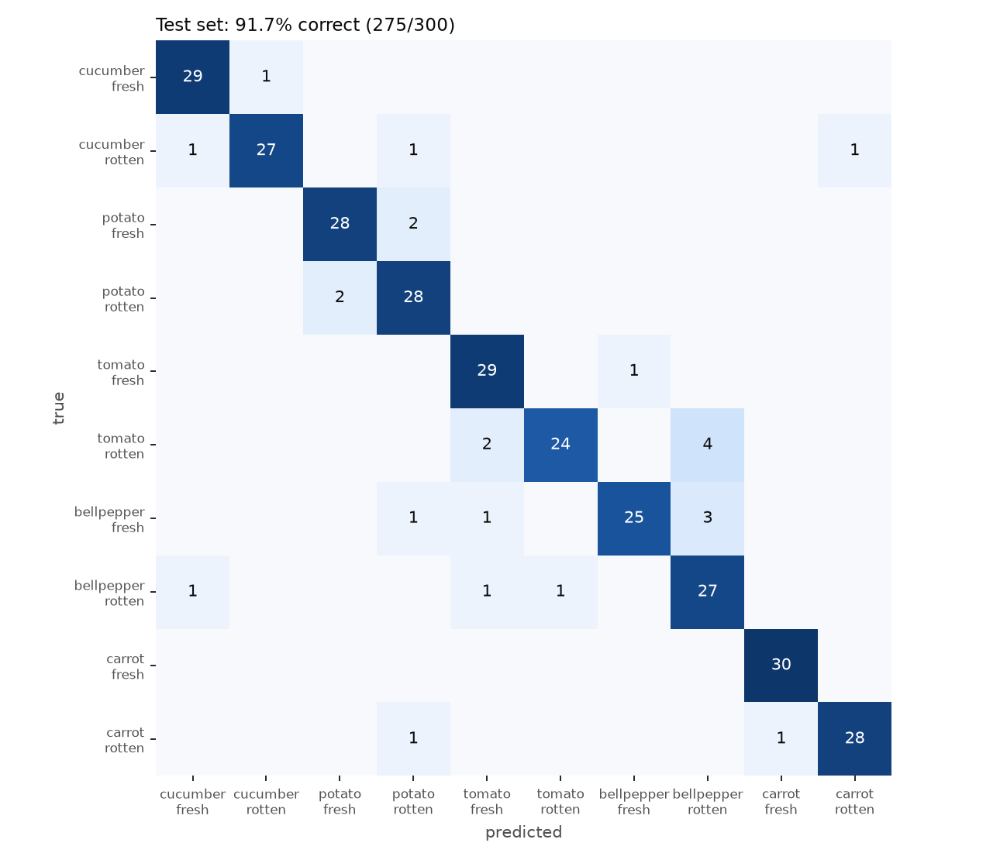

# 채소 종류·신선도 분류 (3차)

1. **1차:** 사진 한 장으로 채소 종류(오이·감자·토마토)와 정상/비정상을 맞히는 6개 클래스 모델을, Kaggle 사진 600장(Test 없음)과 ResNet18(마지막 층만 학습)으로 만들었다.
2. **데이터:** 교수님 상담에 따라 Kaggle 데이터 2개에서 1,200장으로 늘렸고, "채소 종류를 더 늘리라"는 의견에 따라 피망·당근을 더해 1,860장(Train 1,260 / Valid 300 / Test 300)으로 만들었다. 모든 분할에서 정상:비정상은 5:5다.
3. **모델:** "모델 변경 필요" 의견에 따라 EfficientNet-B0 전체 미세조정과 데이터 증강으로 바꿨다.
4. **현재:** 오이·감자·토마토·피망·당근 × 정상·비정상 10개 클래스를, 학습에 쓰지 않은 Test 300장에서 91.7%(275/300) 맞힌다(6개 클래스 때는 Test 180장에서 95.0%). 일부만 상한 채소를 더 잘 잡으려는 추가 실험은 기준을 넘지 못해 채택하지 않았다.
5. **확률과 학습하지 않은 사진:** 예측마다 보정된 확률을 함께 내고, 다섯 채소가 아닌 것 같은 사진에는 "학습된 데이터가 아닙니다"라고 답한다. 일상 사진은 96%를 거르지만 과일 사진은 56%만 거른다.

## 교수님 상담 반영

### 2026.9.23

- **dataset 수집 서두르기:** 완료.
    - 1차 600장(Kaggle 1개)에서 2차 1,200장(Kaggle 2개)으로 늘렸다.
    - 한 장씩 눈으로 검수했고, 같은 사진의 복사본이 여러 분할에 들어가지 않게 걸러냈다.

### 2026.9.30

- **model 변경 필요:** ResNet18(마지막 층만 학습)에서 EfficientNet-B0(전체 미세조정 + 데이터 증강)으로 바꿨다. 같은 Test 180장에서 6개 클래스 정확도가 87.2%에서 95.0%로 올랐다.
- 
- **dataset 구성:** Train·Valid·Test로 나누고, 모든 분할에서 P(정상):N(비정상)을 5:5로 맞췄다. 사진 폴더도 이 표와 같은 모양으로 나눴다.

아래 표와 폴더는 10.7 상담 뒤 피망·당근을 더한 현재 구성이다(2차 때는 Train 840 / Valid 180 / Test 180).

| | Train | Valid | Test | 합계 |
|---|---:|---:|---:|---:|
| **P** (정상, Fresh) | 630 | 150 | 150 | 930 |
| **N** (비정상, Rotten) | 630 | 150 | 150 | 930 |
| **합계** | **1,260** | **300** | **300** | **1,860** |

```
dataset/
├── train/   P_fresh/ 630장   N_rotten/ 630장
├── valid/   P_fresh/ 150장   N_rotten/ 150장
└── test/    P_fresh/ 150장   N_rotten/ 150장
```

- **Train:** 모델 가중치를 학습한다.
- **Valid:** 학습 중 가장 좋은 epoch를 고른다.
- **Test:** 모델을 다 고른 뒤 마지막에 한 번만 채점한다.

### 2026.10.7

- **채소 종류 추가:** 완료. 같은 Kaggle 데이터에서 피망·당근(정상·비정상)을 더해 6개에서 10개 클래스로 늘렸다.
    - 피망·당근 원본 2,402장에서 후보 1,180장을 눈으로 검수해 660장을 썼다. 상한 사진은 고추·다른 채소·멀쩡한 사진이 많아 피망 166장, 당근 164장만 통과했고, 정상도 같은 수로 맞췄다.
    - 기존 1,200장의 분할은 그대로 두었다. 그래서 기존 Test 180장은 새 Test 300장 안에 그대로 들어 있다.
    - 작은 썸네일 복사본은 자동 검사가 놓쳐서, Valid·Test와 닮은 Train 사진 320쌍을 눈으로 보고, 같은 사진이거나 같은 채소를 다시 찍은 스톡 사진인 54쌍을 한 그룹으로 묶었다.

## 1차와 달라진 점

| 항목 | 1차 | 현재 |
|---|---|---|
| 클래스 | 6개 (오이·감자·토마토 × 정상·비정상) | 10개 (+ 피망·당근) |
| 데이터 | 600장 (Train 480 / Valid 120 / Test 0) | 1,860장 (Train 1,260 / Valid 300 / Test 300) |
| 정상:비정상 | 5:5 | 모든 분할에서 5:5 |
| 출처 | Kaggle 1개 | Kaggle 2개 (두 번째는 오이 60장) |
| 중복 검사 | 해시 + 눈 검수 | 해시 + 반전·회전 불변 특징 + ORB 특징점 매칭 + 눈 검수 + 썸네일 복사본 눈 확인 |
| 모델 | ResNet18, 마지막 층만 학습 (3,078개 파라미터) | EfficientNet-B0, 전체 미세조정 (402만 개 파라미터) |
| 데이터 증강 | 없음 | 무작위 자르기·반전·회전·색 변화 |
| 성능 보고 | 모델 선택에 쓴 Valid 점수 | 따로 떼어 둔 Test 점수 (마지막에 한 번만 채점) |

## 데이터셋

구성표는 위 [교수님 상담 반영](#교수님-상담-반영)에 있다. 채소 종류는 파일 이름 앞부분(예: `tomato_rotten_1201.jpg`, `bellpepper_fresh_0012.jpg`)에 있다. 출처, 검수 기준, 같은 사진이 분할 사이에 섞이지 않게 한 방법은 [dataset/README.md](dataset/README.md)에 정리했다.

| 채소 | P(정상) Train / Valid / Test | N(비정상) Train / Valid / Test |
|---|---|---|
| 오이·감자·토마토 (각각) | 140 / 30 / 30 | 140 / 30 / 30 |
| 피망 | 106 / 30 / 30 | 106 / 30 / 30 |
| 당근 | 104 / 30 / 30 | 104 / 30 / 30 |

피망·당근은 상한 사진이 부족해서 Train이 140장보다 적다.

## 결과 (현재 모델)

현재 모델은 `model.pth`(EfficientNet-B0 전체 미세조정, 10개 클래스)다. 24 epoch까지 학습했고, Valid 점수로 16번째 epoch를 골랐다. Test는 마지막에 한 번만 채점했다.

| 항목 | Valid 300장 | Test 300장 |
|---|---:|---:|
| 10개 클래스 | 93.7% (281) | **91.7% (275)** |
| 채소 종류 (5종) | 97.0% (291) | 96.0% (288) |
| 정상/비정상 | 97.0% (291) | 95.3% (286) |
| 비정상 검출률 | 98.7% (148/150) | 95.3% (143/150) |
| 정상 정답률 | 95.3% (143/150) | 95.3% (143/150) |

- **비정상 검출률:** 비정상 사진 150장 중 비정상으로 맞힌 비율
- **정상 정답률:** 정상 사진 150장 중 정상으로 맞힌 비율
- **오차 범위:** Test가 300장이라 한 장이 0.33%p다. Test 10개 클래스 91.7%의 95% 신뢰구간은 88.0–94.3%다.

Test에서 클래스별로 맞힌 수는 다음과 같다.

| 채소 | 정상 | 비정상 |
|---|---:|---:|
| 오이 | 29/30 | 27/30 |
| 감자 | 28/30 | 28/30 |
| 토마토 | 29/30 | 24/30 |
| 피망 | 25/30 | 27/30 |
| 당근 | 30/30 | 28/30 |



- **기존 Test 180장만 보면:** 91.7%(165/180)다. 6개 클래스 모델(95.0%, 171/180)보다 6장 적다.
    - 오이·감자·토마토 사진 6장을 새 클래스(피망·당근)로 답했다. 그중 4장은 상한 토마토를 상한 피망으로 본 것이다.
    - 두 모델이 서로 다르게 맞힌 사진은 10장 대 4장이다. 이 차이는 McNemar 검정 p=0.18로, Test 180장으로는 우연과 구별되지 않는다.
- **새 Test 120장(피망·당근):** 91.7%(110/120)다. 당근은 60장 중 58장, 피망은 52장을 맞혔다.
- **틀린 25장의 유형:**
    - 붉게 물러 터진 토마토 ↔ 상한 피망(4장): 둘 다 붉고 쭈글쭈글해서 헷갈린다.
    - 정상 피망 5장: 작은 웹 썸네일이나 밭에 달린 피망이다. 정상 피망 Train 106장 중 89장이 데이터 제공자가 시장에서 찍은 사진이라, 다른 분위기의 사진에 약하다.
    - 나머지: 이상이 작거나 초기인 사진(싹이 조금 난 감자, 작은 반점), 감자처럼 보이는 갈색 오이 등
- **학습 시간:** CPU 4코어에서 약 30분 걸렸다.
- **추가 학습 시도:** 시드 변경, 썸네일 크기 증강, 더 긴 학습을 Valid로 비교했지만 미리 정한 기준을 넘지 못해 채택하지 않았다. 시드만 바꿔도 Valid가 2.3%p 달라졌다([experiments/10class_tuning](experiments/10class_tuning/README.md)).

### 확률 보정과 "학습된 데이터가 아닙니다"

`predict.py`와 데모 페이지는 모델 출력에 두 가지를 더 한다. 둘 다 Valid 300장만 보고 정했고, Test와 바깥 사진은 정한 뒤 한 번만 채점했다. 자세한 기록은 [results/10class/calibration_unknown](results/10class/calibration_unknown/README.md)에 있다.

- **확률 보정:** 원래 softmax 점수는 실제보다 낮게 나왔다(Test 평균 78.5%, 실제 정답률 91.7%). 학습 때 쓴 label smoothing 때문이다. 점수를 온도 T=0.53으로 나눈 뒤 softmax를 하는 온도 보정(temperature scaling)을 Valid에 맞췄다.
    - Test에서 확률과 실제 정답률의 차이(ECE)가 0.132에서 0.038로 줄었다.
    - 보정 후 Test에서 확률 97% 이상인 사진은 208장이고 그중 97.1%를 맞혔다. 확률 70% 미만인 26장은 61.5%만 맞혔다.
    - 1등 클래스는 바뀌지 않으므로 정확도는 그대로다.
    - 확률이 0.5보다 낮아 `uncertain`으로 표시되는 사진은 Test 3장(오답 2)이다. 보정 전 점수로는 28장이었다.
- **학습하지 않은 사진:** 모델의 10개 출력 점수가 모두 낮으면, 10개 중 하나로 답하지 않고 "학습된 데이터가 아닙니다"라고 답한다.
    - 점수는 energy 점수(−logsumexp)다. 최고 확률, Train 사진과의 거리 등 6가지 방법 중 Valid와 바깥 사진 절반(개발용)으로 골랐다.
    - 기준은 Valid 채소 사진의 95%를 통과시키는 값이다.
    - 바깥 사진의 나머지 절반과 Test로 채점한 결과는 다음과 같다.

| 사진 | 거른 수 |
|---|---:|
| 음식이 없는 일상 사진 (COCO val2017) | 192/200 (96%) |
| 과일 사진 (같은 Kaggle 데이터의 사과·바나나·망고·오렌지·딸기) | 112/200 (56%) |
| Test 채소 사진 (잘못 거른 것) | 10/300 (3.3%) |

- Test에서 거른 10장 중 3장은 원래 틀리게 답한 사진이었다. 거르지 않은 290장의 정확도는 92.4%다.
- 과일은 채소와 같은 사람이 같은 분위기로 찍은 사진이라 거의 절반이 통과한다. 특히 정상 사과·오렌지가 잘 통과한다.

## 내 사진으로 예측하기

Python 3.11~3.12, PyTorch 2.8.0 CPU 환경에서 확인했다.

```bash
python -m pip install torch==2.8.0 torchvision==0.23.0 --index-url https://download.pytorch.org/whl/cpu
python -m pip install "Pillow>=10.0,<12.0" "numpy>=1.26,<3.0" matplotlib
python src/predict.py --model model.pth --input my_photos --output results.csv
```

`my_photos` 폴더에 JPG·PNG 사진을 넣는다. 화면에는 사진마다 `bellpepper_rotten (피망 비정상, probability 99.8%)`처럼 나오고, 다섯 채소가 아닌 것 같은 사진은 `학습된 데이터가 아닙니다`라고 나온다. 결과 CSV의 열은 다음과 같다.
- `predicted_class`: 예측이다. `cucumber`=오이, `potato`=감자, `tomato`=토마토, `bellpepper`=피망, `carrot`=당근이고, `fresh`=정상, `rotten`=비정상이다.
- `known`, `message`: 학습하지 않은 사진으로 보면 `known=no`, `message=학습된 데이터가 아닙니다`, `predicted_class=unknown`이다.
- `probability`: 예측한 클래스의 보정된 확률(0~1)이다. `prob_*` 열은 10개 클래스 각각의 확률이다.
- `species_probability`, `condition_probability`: 채소 종류만, 정상/비정상만 따로 본 확률이다(10개 확률을 더한 값).
- `uncertain`: 확률이 0.5보다 낮으면 `yes`다. 기준은 `--uncertain-below`로 바꿀 수 있다.
- `unknown_score`: 학습하지 않은 사진을 가르는 점수다. `model.pth`에 저장된 기준(−2.28)보다 크면 거른다.
- 보정 정보는 `model.pth` 안에 있다. 새로 학습하면 `train.py`가 Valid로 자동으로 계산해 넣는다. 보정 정보가 없는 예전 가중치는 `python src/calibrate.py --model 가중치.pth`로 붙인다.

## 다시 학습하기

```bash
# 최종 모델 (10개 클래스, EfficientNet-B0 미세조정)
python src/train.py --manifest dataset/manifest.csv --out results/10class/efficientnet_b0_finetune --arch efficientnet_b0 --mode finetune --epochs 30 --patience 8
python src/make_plots.py --runs results/10class

# 6개 클래스 때의 모델 비교 (오이·감자·토마토만, 같은 Test 180장)
python src/train.py --manifest dataset/manifest.csv --num-classes 6 --out results/efficientnet_b0_finetune --arch efficientnet_b0 --mode finetune --epochs 30 --patience 8
python src/train.py --manifest dataset/manifest.csv --num-classes 6 --out results/resnet18_finetune --arch resnet18 --mode finetune --epochs 30 --patience 8
python src/train.py --manifest dataset/manifest.csv --num-classes 6 --out results/resnet18_linear --arch resnet18 --mode linear --no-augment --lr 0.005 --batch-size 16 --label-smoothing 0 --epochs 100 --patience 15
python src/make_plots.py
```

명령은 모두 저장소 맨 위 폴더에서 실행한다. 처음 실행하면 ImageNet 사전학습 가중치를 내려받는다. GPU가 있으면 `--device cuda`를 붙인다. 설정은 Valid 결과만 보고 바꾸고, Test 결과를 보고 설정을 다시 고치지 않는다.

## 파일 구성

```
depp-env22/
├── README.md
├── 학습결과_확인.ipynb      결과를 훑어보는 노트북
├── model.pth                최종 모델 (EfficientNet-B0, 10개 클래스) 가중치와 클래스·전처리·성능 정보
├── requirements.txt         필요한 파이썬 패키지
├── dataset/                 사진 1,860장과 데이터셋 설명
│   ├── train/ valid/ test/  각각 P_fresh/(정상), N_rotten/(비정상)
│   ├── manifest.csv         사진마다 분할·클래스·그룹·출처·해시
│   ├── README.md            출처, 검수 기준, 중복 검사 방법, 다시 만드는 방법
│   ├── summary.json         클래스·분할별 수량과 출처 정보
│   ├── review/              눈 검수 기록 (1차, 2차, 3차)
│   └── tools/               두 Kaggle 원본으로 dataset/을 다시 만드는 스크립트 (2차, 3차)
├── src/
│   ├── train.py             학습
│   ├── predict.py           내 사진 예측 (보정된 확률, "학습된 데이터가 아닙니다")
│   ├── calibrate.py         예전 가중치에 확률 보정·거르기 기준을 붙이는 스크립트
│   ├── model_utils.py       공통 함수 (모델 불러오기, 전처리, 클래스 이름)
│   ├── make_plots.py        학습 곡선, 혼동행렬, 모델 비교 그래프
│   └── gradcam.py           모델이 사진의 어느 부분을 보고 판단했는지 보여주는 그림
├── results/                 실험별 metrics.json, history.csv, val/test_predictions.csv, 그래프
│   ├── 10class/             현재 10개 클래스 모델의 기록 (calibration_unknown/: 확률 보정·거르기 평가)
│   ├── (그 밖의 폴더)       6개 클래스 때의 모델 비교 (같은 Test 180장, 6개 클래스 가중치는 커밋 9dc8749의 model.pth)
│   └── round1_v1_data/      1차 모델의 학습 기록 (1차 가중치는 커밋 03db425에 있음)
└── experiments/             채택하지 않은 추가 실험 기록 (field_tomato, partial_rot, 10class_tuning)
```

가중치는 용량 때문에 최종 모델(`model.pth`)만 올렸다.

## 한계

- Test도 인터넷 사진이다. 직접 찍은 사진에서의 성능은 아직 측정하지 않았다.
- Valid·Test가 각 300장이라 한 장이 0.33%p다. 95% 신뢰구간 폭이 약 ±3%p이므로 1~2%p 차이는 의미 있게 보기 어렵다.
- 학습하지 않은 사진 거르기는 완벽하지 않다. 과일 사진은 44%가 그대로 10개 중 하나로 답하고, 진짜 채소 사진도 3%쯤 거른다. 걸러야 할 사진을 학습에 넣지 않고 출력 점수만 보는 방법이라, 채소와 비슷하게 찍힌 사진에 약하다.
- 피망·당근은 상한 사진이 부족해 Train이 클래스마다 106장·104장으로 다른 채소(140장)보다 적다.
- 정상 피망 Train 106장 중 89장, 정상 당근 Train 104장 중 48장은 데이터 제공자가 직접 찍은 시장 사진이고, 상한 피망·당근은 모두 웹 사진이다. Valid·Test는 모두 웹 사진이라 점수가 부풀지는 않지만, 정상 피망 웹 사진에서 오답이 많다(Test 25/30).
- 개체 ID가 없어서, 같은 채소를 다른 각도로 찍은 사진이 서로 다른 분할에 들어갔을 가능성은 남아 있다. 같은 사진의 복사본은 막았다.
- 토마토 정상 Train 140장 중 83장이 두 촬영 세션에서 왔다.
- 비정상의 세부 유형(부패·싹·상처)은 구분하지 않는다.
- (6개 클래스 모델에서 확인) 꼭지 둘레만 곰팡이가 핀 토마토(몸통은 멀쩡함)를 정상으로 판단한다. 밭 토마토 사진 120장을 더해 다시 학습해 봤지만 이 유형은 고쳐지지 않았고, Test가 1장 떨어져 채택하지 않았다([experiments/field_tomato](experiments/field_tomato/README.md)).
- (6개 클래스 모델에서) 일부만 상한 채소를 더 잘 잡으려고 입력 크기, 풀링, 부분 부패 사진 추가 등 10가지 후보를 시험했다. 어느 것도 미리 정한 기준을 넘지 못해 채택하지 않았다([experiments/partial_rot](experiments/partial_rot/README.md)).

## 참고

- [Fruits and Vegetables Dataset](https://www.kaggle.com/datasets/muhriddinmuxiddinov/fruits-and-vegetables-dataset) (CC0)
- [Fresh and Rotten Classification](https://www.kaggle.com/datasets/swoyam2609/fresh-and-stale-classification) (CDLA-Permissive 1.0)
- [PyTorch 전이학습 공식 안내](https://docs.pytorch.org/tutorials/beginner/transfer_learning_tutorial.html)
- [torchvision 사전학습 모델 목록](https://docs.pytorch.org/vision/stable/models.html)
