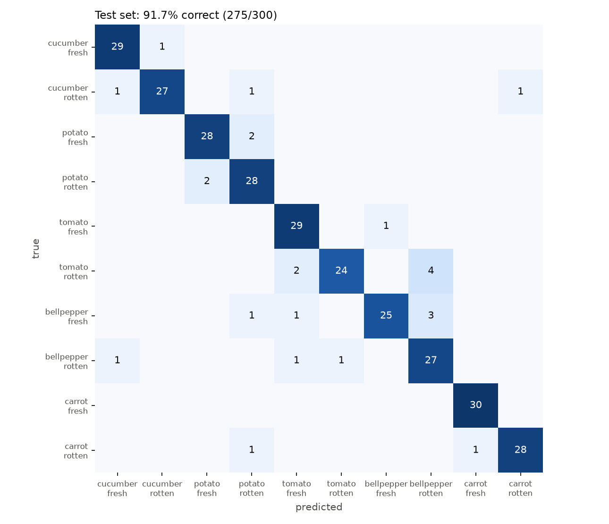

# 채소 종류·신선도 분류 (현재 버전 TV-12)

사진 한 장을 보고 채소 8종(오이·감자·토마토·피망·당근, 양파·고구마·대파)의 종류와 정상/상함을 답한다. 학습하지 않은 것 같은 사진에는 "학습된 데이터가 아닙니다"라고 답한다. 채소 모델(EfficientNet-B0)과 CLIP 분류기 두 개를 함께 쓰고, 대파는 종류만 본다.

## 한눈에 보는 성적 (TV-12)

| 시험지 | 다섯 채소 맞게 남김 | 상한 채소를 정상이라고 답함 |
|---|---:|---:|
| **처음 보는 인터넷 사진 T3 (대표 성능)** | **79.6%** (109/137, 95% 구간 72~86%) | 21% (8/38) |
| 새 인터넷 241 (10번 사용) | 78.0% (188/241) | 16% (16/101) |
| Test 300 (학습과 같은 출처, 15번 사용) | 95.0% (285/300) | 4% (6/150) |

- Test 300은 학습 사진과 같은 데이터셋이고 여러 번 써서 실제보다 높다. 실제 사진 성능은 T3 기준 약 80%로 본다.
- Test 300은 이제 블라인드 테스트셋이 아니다. 틀린 15장을 직접 보고 원인을 나눴기 때문이다(2026-11-03). 이후 실험에서는 참고로만 쓴다.
- 거르기: 일상 사진은 100%, 과일 사진은 93%를 거른다. T3의 "다섯 채소가 아닌 사진"은 70장 중 48장(69%)을 걸렀다.
- 양파·고구마·대파: 새 채소 시험지 198장에서 종류를 89%(176장) 맞힌다.
- 자세한 표: [results/scorecard](results/scorecard/README.md). 데이터 출처: [data_sources.md](data_sources.md). 실험 목록: [experiments/README.md](experiments/README.md).

## 지금까지 한 일

1. **시작 (TV-1~TV-3):** 오이·감자·토마토 6개 클래스(ResNet18, Kaggle 600장)에서 시작했다. 교수님 의견에 따라 데이터를 1,860장(Train 1,260 / Valid 300 / Test 300, 정상:비정상 5:5)으로 늘리고 피망·당근을 더했으며, EfficientNet-B0 전체 미세조정으로 바꿨다.
2. **판정 구조 (TV-4~TV-8):** 확률 보정과 "학습된 데이터가 아닙니다" 거르기를 넣었다. CLIP 분류기를 채소 모델과 함께 쓰고, 그 분류기에 "다섯 채소가 아님"(과일·일상 사진·다른 채소)을 가르쳤다. 채소 모델만 쓰면 Test 91.3%다.
3. **양파·고구마·대파 (TV-9·TV-10):** 두 번째 CLIP 분류기가 세 채소일 때만 답을 바꾼다. 감자를 고구마로 답하는 경우가 생겨 새 인터넷 시험지 점수가 3장 줄었다([new_vegetables](experiments/new_vegetables/README.md)).
4. **워터마크 지름길 (TV-11):** 상한 사진의 절반쯤에 스톡 워터마크가 있어 모델이 "사진 위 글자 = 상함"을 배웠다. 가짜 워터마크를 넣어 다시 학습해, 워터마크 때문에 답이 바뀌는 사진을 17장에서 6~8장으로 줄였다([watermark](experiments/watermark/README.md)).
5. **글 설명으로 거르기 (TV-12):** 처음 보는 시험지 T3로 채택했다. T3에서 거른 "다섯 채소가 아닌 사진"이 41장에서 48장으로 늘었다([results/t3_test](results/t3_test/README.md)).
6. **추가 기능:** 상했다고 본 부분을 사진 위에 빨갛게 표시한다([추가 기능](results/10class/extra_features/README.md)).
7. **채택하지 않은 시도:** 공통점은 밭·휴대폰 사진에서 떨어지거나 효과가 없었다는 것이다([실험 색인](experiments/README.md)).
    - T3 약점 고치기(후보 6개)
    - 학습 사진 수 균형 맞추기(개발용 718장 중 655 → 655)
    - 새 사진 없이 판정 개선(글 설명 점수 섞기, 사진 조각 보기)
8. **판단 보류 (답하는 방식만 바꿈, `model.pth`는 그대로):** 확률이 90% 미만이면 답 대신 "판단 보류"와 가장 가까운 답, 안내를 보여 준다.
    - 바깥 개발용 사진 403장에서 81%에 답하고, 답한 사진의 정답률이 91.6%에서 96.3%로 오른다.
    - 자신 있게 틀린 답은 34장에서 12장으로 준다.
    - 보류한 77장 중 55장은 원래 맞았을 사진이다([improve_without_photos](experiments/improve_without_photos/README.md)).
9. **남은 약점:** 원인은 실제로 찍은 사진(휴대폰·부엌·마트)이 학습에 거의 없기 때문으로 본다.
    - 흙 묻은 정상 감자를 상했다고 본다(T3에서 20장 중 10장만 맞힘).
    - 상한 토마토 초기 증상을 놓친다.
    - 처음 보는 사진에서 상한 채소 5개 중 1개를 정상이라고 답한다.

## 버전 (TV = test version)

채택해서 `model.pth`의 판정이 바뀔 때마다 버전 번호를 하나씩 올렸다. 표의 커밋으로 그 버전의 코드와 가중치를 받을 수 있다(예: TV-3은 `git checkout 78fe987`). 실험 기록 안의 후보 이름(V7, WC, N3 등)은 그대로 두고, 채택된 후보에 버전 이름을 함께 적었다.

| 버전 | 날짜 | 커밋 | 바뀐 것 | Test (정확도 / 맞게 남긴 수) | 새 인터넷 시험지 241장 |
|---|---|---|---|---:|---:|
| TV-1 | 10.04 | `03db425` | 1차: ResNet18(마지막 층만 학습), 6개 클래스, Kaggle 600장 | Test 없음 | – |
| TV-2 | 10.05 | `2a3b851` | 2차: EfficientNet-B0 전체 미세조정 + 증강, 6개 클래스, 1,200장 | 180장 중 171 (95.0%) | – |
| TV-3 | 10.08 | `78fe987` | 3차: 피망·당근 추가, 10개 클래스, 1,860장 | 275 (91.7%) | – |
| TV-4 | 10.08 | `2bdf7e8` | 확률 보정 + "학습된 데이터가 아닙니다" 거르기 | 275 / 268 | – |
| TV-5 | 10.11 | `38e1736` | 거르기 기준을 실제 장면 채소로 다시 맞춤 ([real_scene_threshold](experiments/real_scene_threshold/README.md)) | 275 / 272 | – |
| TV-6 | 10.24 | `5b1f7d7` | CLIP 분류기를 채소 모델과 함께 씀 ([clip_classifier](experiments/clip_classifier/README.md)) | 284 / 280 | 191 / 165 |
| TV-7 | 10.28 | `cc21bb9` | CLIP 분류기에 "다섯 채소가 아님" 클래스 (후보 N3, [not_five_class](experiments/not_five_class/README.md)) | 288 / 282 | 203 / 169 |
| TV-8 | 10.29 | `0e91fb8` | CLIP 분류기 기준 하나로만 거르기 (후보 R1, [clip_only_reject](experiments/clip_only_reject/README.md)) | 288 / 285 | 203 / 193 |
| TV-9 | 10.31 | `42724fe` | 양파·고구마·대파 추가, 8종 (후보 V6-H, [new_vegetables](experiments/new_vegetables/README.md)) | 288 / 285 | 199 / 189 |
| TV-10 | 11.01 | `971190e` | 상한 고구마·대파 개선, CLIP 글 설명 섞기 (후보 V7) | 288 / 285 | 200 / 190 |
| TV-11 | 11.01 | `f18a159` | 작고 반투명한 가짜 워터마크로 다시 학습 (후보 WC, [watermark](experiments/watermark/README.md)) | 287 / 284 | 199 / 189 |
| **TV-12** | 11.01 | `9ebb286` | CLIP 글 설명으로 거르기 보강 (후보 ZS8, [zero_shot_reject](experiments/zero_shot_reject/README.md), [T3](results/t3_test/README.md)) | **287 / 285** | **199 / 188** |

- TV-9부터는 8종 시스템의 결과다. 새 채소 시험지 1~4(198장)에서 TV-10 ~ TV-12는 176장(89%)의 종류를 맞힌다.
- TV-12는 시험지 T3(247장)에서 다섯 채소 109/137을 맞게 남기고, 다섯 채소가 아닌 사진 48/70을 거른다(TV-11은 108, 41).
- TV-1 ~ TV-5는 채소 모델 하나만 쓴다. TV-6부터는 채소 모델과 CLIP 분류기를 합친다.
- 같은 이름의 git 태그를 붙이는 명령이다. 저장소 쓰기 권한이 있는 컴퓨터에서 한 번 실행하면 GitHub에서 `TV-3`처럼 이름으로 고를 수 있다.

```bash
git fetch origin claude/great-planck-vnvyxx
for v in "TV-1 03db425" "TV-2 2a3b851" "TV-3 78fe987" "TV-4 2bdf7e8" "TV-5 38e1736" "TV-6 5b1f7d7" \
         "TV-7 cc21bb9" "TV-8 0e91fb8" "TV-9 42724fe" "TV-10 971190e" "TV-11 f18a159" "TV-12 9ebb286"; do
  set -- $v; git tag -a "$1" "$2" -m "$1"
done
git push origin --tags
```

## 교수님 상담 반영

### 2026.9.23

- **dataset 수집 서두르기:** 완료.
    - 1차 600장(Kaggle 1개)에서 2차 1,200장(Kaggle 2개)으로 늘렸다.
    - 한 장씩 눈으로 검수했고, 같은 사진의 복사본이 여러 분할에 들어가지 않게 걸러냈다.

### 2026.9.30

- **model 변경 필요:** ResNet18(마지막 층만 학습)에서 EfficientNet-B0(전체 미세조정 + 데이터 증강)으로 바꿨다. 같은 Test 180장에서 6개 클래스 정확도가 87.2%에서 95.0%로 올랐다.
- 
- **dataset 구성:** Train·Valid·Test로 나누고, 모든 분할에서 P(정상):N(비정상)을 5:5로 맞췄다. 사진 폴더도 이 표와 같은 모양으로 나눴다.

아래 표와 폴더는 10.7 상담 뒤 피망·당근을 더한 현재 구성이다(2차 때는 Train 840 / Valid 180 / Test 180).

| | Train | Valid | Test | 합계 |
|---|---:|---:|---:|---:|
| **P** (정상, Fresh) | 630 | 150 | 150 | 930 |
| **N** (비정상, Rotten) | 630 | 150 | 150 | 930 |
| **합계** | **1,260** | **300** | **300** | **1,860** |

```
dataset/
├── train/   P_fresh/ 630장   N_rotten/ 630장
├── valid/   P_fresh/ 150장   N_rotten/ 150장
└── test/    P_fresh/ 150장   N_rotten/ 150장
```

- **Train:** 모델 가중치를 학습한다.
- **Valid:** 학습 중 가장 좋은 epoch를 고른다.
- **Test:** 모델을 다 고른 뒤 마지막에 한 번만 채점한다.

### 2026.10.7

- **채소 종류 추가:** 완료. 같은 Kaggle 데이터에서 피망·당근(정상·비정상)을 더해 6개에서 10개 클래스로 늘렸다.
    - 피망·당근 원본 2,402장에서 후보 1,180장을 눈으로 검수해 660장을 썼다. 상한 사진은 고추·다른 채소·멀쩡한 사진이 많아 피망 166장, 당근 164장만 통과했고, 정상도 같은 수로 맞췄다.
    - 기존 1,200장의 분할은 그대로 두었다. 그래서 기존 Test 180장은 새 Test 300장 안에 그대로 들어 있다.
    - 작은 썸네일 복사본은 자동 검사가 놓쳐서, Valid·Test와 닮은 Train 사진 320쌍을 눈으로 보고, 같은 사진이거나 같은 채소를 다시 찍은 스톡 사진인 54쌍을 한 그룹으로 묶었다.

### 2026.10 (외부 모델 사용 문의)

- **"외부 모델이든 무엇이든 개선만 되면 된다":** CLIP(인터넷 사진 수억 장으로 학습한 공개 모델)의 특징 위에 우리 10개 클래스 분류기를 학습시켜, 채소 모델과 함께 쓰게 했다.
    - Test 10개 클래스 정확도가 91.7%에서 94.7%로 올랐다.
    - 인터넷 사진 정확도는 75.6%에서 86.0%로 올랐다.
    - 과일 사진을 거르는 비율도 27%에서 65%로 올랐다([experiments/clip_classifier](experiments/clip_classifier/README.md)).
- **이어서 (2026.10.28):** CLIP 분류기에 "다섯 채소가 아님"(과일 1,375장·일상 사진 1,106장·다른 채소 374장)을 11번째 클래스로 가르치고, 채소 쪽에 약점 사진 등 1,773장을 더했다(후보 N3, TV-7).
    - 새 인터넷 블라인드 테스트셋 241장: 79.3% → 84.2%
    - Test: 94.7% → 96.0%
    - 과일 거르기: 65% → 93%
    - 자세한 내용은 [experiments/not_five_class](experiments/not_five_class/README.md)에 있고, 과대·과소적합·회전·전처리 점검은 [results/10class/system_checks](results/10class/system_checks/README.md)에 있다.
- **이어서 (2026.10.29):** 점검에서 진짜 채소를 거르는 일이 주로 채소 모델의 거르기 기준 때문으로 나와서, CLIP 분류기 기준 하나로만 거르게 했다(후보 R1, TV-8). 새 인터넷 시험지에서 거른 진짜 채소가 49장(20%)에서 14장(5.8%)으로 줄고, 맞게 남긴 수가 169장에서 193장으로 늘었다([experiments/clip_only_reject](experiments/clip_only_reject/README.md)).

### 2026.10.31

- **진행 계속 + 시험 사진 정보도 보여 주기:** 시험 사진을 역할별로 정리했다. 블라인드 테스트셋은 학습과 조정에 쓰지 않고, 개선안을 다 만든 뒤 마지막 평가에만 한 번 쓰는 시험지다.

| 시험 사진 | 장 수 | 출처 | 쓰임 | 지금 결과 |
|---|---:|---|---|---:|
| Valid | 300 | 학습과 같은 Kaggle | 학습 중 조정 | 96.3% |
| Test | 300 | 학습과 같은 Kaggle | 마지막 평가 (지금까지 15번) | 95.7% |
| 160장 시험지 | 160 | 연구용 데이터셋 6곳 (휴대폰·밭 사진) | 개발용 | 91.9% |
| 첫 인터넷 시험지 | 221 | Flickr·Wikimedia | 개발용 (여러 번 봄) | 90.0% |
| 새 인터넷 시험지 (블라인드) | 241 | Flickr·iNaturalist, 상한 사진 42% | 마지막 평가 (지금까지 10번) | 82.6% |
| "아무 사진" 시험지 (블라인드) | 255 | Flickr·iNaturalist, 과일·음식·일상 사진·다섯 채소 | 마지막 평가 (8종용 v2 포함 8번) | 좋은 답 88% |
| 인터넷 과일 / 일상 사진 | 374 / 400 | Flickr·Wikimedia / COCO | 거르기 확인 (개발용) | 93% / 100% 거름 |
| 새 채소 Valid | 89 | iNaturalist·Openverse·Wikimedia·Kaggle·LVIS | 개발용 (양파·고구마·대파) | 종류 88% |
| 새 채소 시험지 1~4 (블라인드) | 97 / 54 / 21 / 26 | 위와 같음, 올린 사람 단위로 분리 | 마지막 평가 (7 / 6 / 5 / 4번) | 종류 89% |
| **시험지 T3** | 247 | iNaturalist·Wikimedia Commons, 예전에 사진을 올린 적 없는 사람 | 마지막 평가 (2번, 2번째는 참고) | 다섯 채소 79.6%, 거름 69% |
| 시험지 T5 | 140 | iNaturalist·Wikimedia Commons | 마지막 평가 (1번, [기록](results/t5_test/README.md)) | 다섯 채소 92% (58/63), 거름 67% |
| 시험지 T6 | 175 | iNaturalist·Openverse·Commons·공개 데이터셋, 약점 사진 위주 | 마지막 평가 (1번, [기록](results/t6_test/README.md)) | 다섯 채소 86% (83/97), 거름 76% |
| 시험지 T7 | 46 | iNaturalist, 줄기에서 딴 실제 장면 토마토 | 마지막 평가 (1번, [기록](results/t7_test/README.md)) | 상한 토마토 88% (살짝 83%), 정상 토마토 93% |

- 지금 결과는 8종 시스템(TV-12) 기준이다. TV-11에서 다섯 채소만 쓰면(`--five-only`) 첫 인터넷 시험지 90.0%, 새 인터넷 시험지 83.8%, 아무 사진(새 채소가 아닌 247장) 84%였다.

- **아무 사진이나 넣어도 결과가 잘 나와야 함:**
    - 데모 페이지가 처음에 채소 모델만으로 답하던 것을, 최종 판정(채소 모델 + CLIP)으로 바로 답하게 바꿨다.
    - 과일·음식·그림·일상 사진·다른 채소와 다섯 채소를 섞은 ["아무 사진" 시험지 255장](results/10class/anyphoto_test/README.md)을 만들었다. 지금 시스템은 82%에 알맞게 답한다(초기 모델 14%).
    - 상한 과일을 가르친 후보 F1은 93%까지 올랐지만, 진짜 상한 채소도 더 걸러 미리 정한 기준에 못 미쳐 채택하지 않았다([fruit_farm_tomato](experiments/fruit_farm_tomato/README.md)).
- **상한 토마토:** 두 모델을 합치는 비중을 바꿔 봤지만, CLIP 분류기가 덜 익은 정상 토마토를 상했다고 봐서 채택하지 않았다([fusion_weight](experiments/fusion_weight/README.md)).
- **채소 종류 추가 (양파·고구마·대파):** 직접 찍기 어려워 인터넷 공개 사진 700장을 모아 하나씩 검수했다. 여러 후보 중 V7을 채택했다(TV-10, [experiments/new_vegetables](experiments/new_vegetables/README.md)).
    - **실패한 방식:**
        - 채소 모델을 16칸으로 다시 학습하면 기존 채소가 떨어졌다(V4).
        - 새 분류기가 종류를 먼저 고르게 하면 상한 토마토·감자를 양파·고구마로 보냈다(V4-R).
    - **채택한 방식:** 다섯 채소 시스템이 먼저 답하고, 새 CLIP 분류기는 거른 사진이거나 새 채소일 확률이 80% 이상일 때만 답을 바꾼다. 새 분류기에는 CLIP이 원래 아는 글 설명("싹 난 고구마", "대파 묶음" 등)과의 유사도를 0.25배 섞었다.
    - **결과:** 새 채소 시험지 198장 중 176장(89%)의 종류를 맞힌다. 대파는 44장 중 38장으로 좋아졌고, 상한 고구마는 23장 중 15장으로 아직 약하다.
    - **사진 수:** 약점이던 대파·상한 양파·상한 고구마 사진을 더 모았다(상한 고구마 학습 22 → 44장, 대파 42 → 97장). 증강으로 평균을 채운 판과 클래스 균형 가중치는 개발용 사진에서 나아지지 않아 쓰지 않았다.
- **초기 모델부터 지금까지 비교:** [model_comparison](results/10class/model_comparison/README.md)에 있다. 같은 출처 Test는 86.7% → 96.0%, 처음 보는 인터넷 사진은 61.8% → 84.2%, 아무 사진은 14% → 82%다(TV-10 기준, TV-11·TV-12에서는 Test 95.7%, 인터넷 사진 83.8%).
- **피지컬 AI 활용:** 수확 로봇이나 선별 컨베이어의 "눈"으로 쓰는 방안을 정리했다.
    - 지금 갖춘 것: 종류·상태 판별(보정된 확률), 상한 곳 대략 표시(7×7칸 히트맵), 모르면 멈추기(거르기, 다시 찍기 안내)
    - 더 필요한 것: 사진 속 채소 하나하나 찾기, 밭 사진 학습, 상한 부위 경계
    - 속도: 4코어 CPU에서 사진 한 장에 약 0.18초

## 1차와 달라진 점

| 항목 | 1차 | 현재 |
|---|---|---|
| 클래스 | 6개 (오이·감자·토마토 × 정상·비정상) | 10개 (+ 피망·당근) |
| 데이터 | 600장 (Train 480 / Valid 120 / Test 0) | 1,860장 (Train 1,260 / Valid 300 / Test 300) |
| 정상:비정상 | 5:5 | 모든 분할에서 5:5 |
| 출처 | Kaggle 1개 | Kaggle 2개 (두 번째는 오이 60장) |
| 중복 검사 | 해시 + 눈 검수 | 해시 + 반전·회전 불변 특징 + ORB 특징점 매칭 + 눈 검수 + 썸네일 복사본 눈 확인 |
| 모델 | ResNet18, 마지막 층만 학습 (3,078개 파라미터) | EfficientNet-B0, 전체 미세조정 (402만 개 파라미터) |
| 데이터 증강 | 없음 | 무작위 자르기·반전·회전·색 변화 |
| 성능 보고 | 모델 선택에 쓴 Valid 점수 | 따로 떼어 둔 Test 점수 (마지막에 한 번만 채점) |

## 데이터셋

구성표는 위 [교수님 상담 반영](#교수님-상담-반영)에 있다. 채소 종류는 파일 이름 앞부분(예: `tomato_rotten_1201.jpg`, `bellpepper_fresh_0012.jpg`)에 있다. 출처, 검수 기준, 같은 사진이 분할 사이에 섞이지 않게 한 방법은 [dataset/README.md](dataset/README.md)에 정리했다.

| 채소 | P(정상) Train / Valid / Test | N(비정상) Train / Valid / Test |
|---|---|---|
| 오이·감자·토마토 (각각) | 140 / 30 / 30 | 140 / 30 / 30 |
| 피망 | 106 / 30 / 30 | 106 / 30 / 30 |
| 당근 | 104 / 30 / 30 | 104 / 30 / 30 |

피망·당근은 상한 사진이 부족해서 Train이 140장보다 적다.

## 결과 (현재 모델)

`model.pth`에는 채소 모델(EfficientNet-B0 전체 미세조정)과, CLIP 특징 위에서 학습한 분류기(`clip_head`)가 함께 들어 있다. `predict.py`는 두 모델의 판단을 합친다.

| Test 300장 | 채소 모델 + CLIP (TV-11·TV-12) | TV-6 (CLIP 10클래스) | 채소 모델만 (TV-11·TV-12) |
|---|---:|---:|---:|
| 10개 클래스 | **95.7% (287)** | 94.7% (284) | 91.3% (274) |
| 채소 종류 (5종) | 98.7% (296) | 97.0% (291) | 96.7% (290) |
| 정상/비정상 | 97.0% (291) | 97.0% (291) | 95.7% (287) |
| 비정상 검출률 | 96.0% (144/150) | 96.0% (144/150) | 94.7% (142/150) |
| 정상 정답률 | 98.0% (147/150) | 98.0% (147/150) | 96.7% (145/150) |
| 새 인터넷 시험지 241장 (블라인드, 다섯 채소만 쓸 때) | **83.8% (202)** | 79.3% (191) | – |
| 첫 인터넷 사진 221장 (개발용) | 90.0% (199) | 86.0% (190) | 75.6% (167) |

- CLIP 분류기를 함께 쓰는 방법과 "다섯 채소가 아님" 클래스는 결과를 보기 전에 규칙을 정해 두고 시험했다. 자세한 과정과 한계는 [experiments/clip_classifier](experiments/clip_classifier/README.md), [experiments/not_five_class](experiments/not_five_class/README.md), [experiments/clip_only_reject](experiments/clip_only_reject/README.md)에 있다.
- TV-12는 거르기만 바꿨으므로 위 정확도는 TV-11과 같다. 거르지 않고 맞게 답한 수(맞게 남긴 수)는 TV-11에서 Test 284장, 새 인터넷 시험지 192장이고, TV-12(8종)에서 Test 285장, 새 인터넷 시험지 188장이다. 거르기는 CLIP 분류기 기준 하나로만 한다(TV-12는 글 설명 유사도를 0.25배 더함).
- **양파·고구마·대파 (8종, TV-10에서 채택한 분류기를 TV-11·TV-12도 그대로 씀):** `model.pth`의 `new_vegetable_head`(두 번째 CLIP 분류기)가 다섯 채소 시스템의 답을 양파·고구마·대파로 바꿀 수 있다.

| | 다섯 채소만 (TV-11) | 8종 (TV-11) | 8종 (TV-12) |
|---|---:|---:|---:|
| Test 300장 (정확도 / 맞게 남긴 수) | 287 / 284 | 287 / 284 | 287 / 285 |
| 새 인터넷 시험지 241장 | 202 / 192 | 199 / 189 | 199 / 188 |
| 새 채소 시험지 198장 (종류 맞고 안 거름) | 0 | **176 (89%)** | **176 (89%)** |
| ↳ 양파 정상 56 / 비정상 28 | – | 53 / 26 | |
| ↳ 고구마 정상 47 / 비정상 23 | – | 44 / 15 | 상한 고구마 15 |
| ↳ 대파 44 | – | 38 | |
| "아무 사진" 247장 좋은 답 (새 채소 6장 따로) | – | 205 (6/6) | **216 (6/6)** |
- 아래는 채소 모델만의 결과다.

### 채소 모델(EfficientNet-B0)만

채소 모델은 가벼운 가짜 워터마크를 넣어 20 epoch까지 학습했고, Valid 점수로 12번째 epoch를 골랐다([watermark](experiments/watermark/README.md)). Test는 마지막에 한 번만 채점했다.

| 항목 | Valid 300장 | Test 300장 |
|---|---:|---:|
| 10개 클래스 | 93.3% (280) | **91.3% (274)** |
| 채소 종류 (5종) | 97.3% (292) | 96.7% (290) |
| 정상/비정상 | 95.0% (285) | 95.7% (287) |
| 비정상 검출률 | 96.7% (145/150) | 94.7% (142/150) |
| 정상 정답률 | 93.3% (140/150) | 96.7% (145/150) |

- **비정상 검출률:** 비정상 사진 150장 중 비정상으로 맞힌 비율
- **정상 정답률:** 정상 사진 150장 중 정상으로 맞힌 비율
- **오차 범위:** Test가 300장이라 한 장이 0.33%p다. Test 10개 클래스 91.3%의 95% 신뢰구간은 87.6–94.0%다.

Test에서 클래스별로 맞힌 수는 다음과 같다.

| 채소 | 정상 | 비정상 |
|---|---:|---:|
| 오이 | 29/30 | 27/30 |
| 감자 | 28/30 | 28/30 |
| 토마토 | 29/30 | 24/30 |
| 피망 | 25/30 | 27/30 |
| 당근 | 30/30 | 28/30 |



- **기존 Test 180장만 보면:** 91.7%(165/180)다. 6개 클래스 모델(95.0%, 171/180)보다 6장 적다.
    - 오이·감자·토마토 사진 6장을 새 클래스(피망·당근)로 답했다. 그중 4장은 상한 토마토를 상한 피망으로 본 것이다.
    - 두 모델이 서로 다르게 맞힌 사진은 10장 대 4장이다. 이 차이는 McNemar 검정 p=0.18로, Test 180장으로는 우연과 구별되지 않는다.
- **새 Test 120장(피망·당근):** 91.7%(110/120)다. 당근은 60장 중 58장, 피망은 52장을 맞혔다.
- **틀린 25장의 유형:**
    - 붉게 물러 터진 토마토 ↔ 상한 피망(4장): 둘 다 붉고 쭈글쭈글해서 헷갈린다.
    - 정상 피망 5장: 작은 웹 썸네일이나 밭에 달린 피망이다. 정상 피망 Train 106장 중 89장이 데이터 제공자가 시장에서 찍은 사진이라, 다른 분위기의 사진에 약하다.
    - 나머지: 이상이 작거나 초기인 사진(싹이 조금 난 감자, 작은 반점), 감자처럼 보이는 갈색 오이 등
- **학습 시간:** CPU 4코어에서 약 30분 걸렸다.
- **추가 학습 시도:** 시드 변경, 썸네일 크기 증강, 더 긴 학습을 Valid로 비교했지만 미리 정한 기준을 넘지 못해 채택하지 않았다. 시드만 바꿔도 Valid가 2.3%p 달라졌다([experiments/10class_tuning](experiments/10class_tuning/README.md)).
- **CLIP 분류기 함께 쓰기 (채택, TV-6):** CLIP 특징 위에 10개 클래스 분류기를 학습시켜 채소 모델과 합쳤다. Test 91.7% → 94.7%, 인터넷 사진 75.6% → 86.0%다. CLIP 분류기만 쓰면 정상 토마토·피망을 비정상으로 보는 경우가 많아, 정상·상함 구분에 강한 채소 모델과 합쳤다([experiments/clip_classifier](experiments/clip_classifier/README.md)).
- **CLIP 분류기를 더 다양한 사진으로 다시 학습 (채택 안 함, 1장 차이):** 예전에 검수한 휴대폰·밭 사진 등 1,168장을 CLIP 분류기 학습에만 더했다. 인터넷 사진의 상한 토마토는 24장에서 30장으로 좋아졌지만, 과일 거른 수가 244장에서 233장으로 줄어 기준(234장)에 1장 모자랐다([experiments/clip_head_more_data](experiments/clip_head_more_data/README.md)).
- **뒤집기 평균(TTA) 시도:** 사진을 좌우·상하로 뒤집은 4장의 예측을 평균 냈다. 채소 모델만 쓸 때는 Valid가 281장에서 284장으로 올랐지만, CLIP 분류기와 합친 지금 시스템에서는 인터넷 채소 맞게 남긴 수가 173장에서 168장으로 줄어 채택하지 않았다([experiments/tta](experiments/tta/README.md)).
- **채소 놓치지 않기 (채택, TV-5):** 거르기 기준을 실제 장면 채소 사진으로 다시 맞췄다. Test에서 잘못 거른 채소가 10장에서 5장으로 줄었고, 인터넷 채소 맞게 남긴 수는 138장에서 158장으로 늘었다. 대신 인터넷 과일 거른 수는 233장에서 101장으로 줄었다([experiments/real_scene_threshold](experiments/real_scene_threshold/README.md)).
- **CLIP 문지기 (채택 안 함):** 채소 모델 앞에 CLIP을 두고 "다섯 채소 중 하나인가?"만 물었다. 인터넷 과일 거른 수가 101장에서 353장(94%)으로, 일상 사진은 311장에서 392장(98%)으로 늘었고, 인터넷 채소 맞게 남긴 수는 158장에서 155장으로 조금 줄었다. 하지만 상한 토마토를 감·대추로 봐서 160장 시험지가 기준에 1장 모자랐다(141 < 142). 교수님 답변 후 Test를 한 번 채점해 보니, 맞게 남긴 수가 272장에서 266장으로 줄어 마지막 기준(269장)도 넘지 못했다. 거른 6장이 모두 상한 채소(오이·감자·토마토)였다([experiments/clip_gate](experiments/clip_gate/README.md)).
- **논문 방법을 재학습 없이 적용:** 가중치 평균(model soup), ViM·KNN 같은 특징 공간 점수, 실제 장면 사진으로 맞춘 거르기 기준을 묶어 적용했다. 인터넷 채소 맞게 남긴 수는 138장에서 149장으로 늘었지만, 인터넷 과일 거른 수가 233장에서 106장으로 줄어 채택하지 않았다. 대부분 "채소 남기기"와 "과일 거르기" 사이에서 저울을 옮긴 것이었고, KNN 점수만 양쪽을 함께 조금 나아지게 했다([experiments/posthoc_literature](experiments/posthoc_literature/README.md)).
- **과일 판별 모델을 앞에 따로 두기 시도:** 채소 모델은 그대로 두고, 앞에 "과일인지 채소인지"만 가리는 작은 모델(MobileNetV3-Small)을 두었다. 160장 시험지 점수는 그대로였고, 인터넷 과일 거른 수는 233장에서 278·296장(74~79%)으로 늘었다. 하지만 미리 정한 80%에 못 미쳤고, 인터넷 채소 7~11장을 과일로 봐서 채택하지 않았다. 2차로 과일 학습 사진을 671장에서 2,667장으로 늘리자 인터넷 과일을 85% 걸렀지만(감 23장 중 14~16장), 인터넷 채소 맞게 남긴 수가 기준에 3장 모자라 이번에도 채택하지 않았다. 3차로 실제 장면(부엌·시장) 채소·과일 사진을 더해도 결과는 같았다. 마지막으로 Test를 한 번 채점해 보니 문지기가 Test 채소 300장 중 11장을 과일로 봐서(맞게 남긴 수 268 → 261), 쓰지 않기로 했다([experiments/fruit_gate](experiments/fruit_gate/README.md)).
- **과일 거르기 시도 ("기타" 클래스):** 과일 사진 287장을 11번째 클래스로 학습시키자, 인터넷 과일 사진 374장 중 거른 수가 233장에서 322·335장으로 크게 늘었다(학습에 없는 과일도 포함). 하지만 둥글고 매끈한 토마토·감자를 과일로 보는 실수가 생겨 Valid와 160장 시험지가 기준에 못 미쳐 채택하지 않았다. 감은 여전히 절반 이상 통과했다([experiments/fruit_other](experiments/fruit_other/README.md)).
- **아시아 오이 학습 시도:** 인터넷에 올라온 한국·일본·중국 오이 정상 사진 37장으로 확인해 보니, 현재 모델은 30장(81%)만 맞혔다(서양식 정상 오이는 12장 모두 맞힘). 가시·돌기가 많은 오이를 상했다고 본 것이 4장이다. 동아시아형이 많은 오이 품종 연구용 사진 60장(Zenodo)을 Train에 넣자 한 시드는 35장으로 좋아졌지만 다른 시드는 30장 그대로였고, 160장 시험지도 기준에 못 미쳐 채택하지 않았다. 2차로 기존 정상 오이 140장과 동아시아 오이 140장을 5:5로 맞춰도 두 시드 합은 1차와 같은 65장(37장×2 중)이었다([experiments/asian_cucumber](experiments/asian_cucumber/README.md)).
- **흙 묻은 당근·쪼그라든 오이 오답 고치기 시도:** 새 시험지에서 나온 두 오답의 원인을 찾아 학습 사진을 고쳤다. 마르거나 거칠기만 한 "상한 당근" 57장을 빼고, 흙 묻은 정상 당근 30장, 갈색으로 쪼그라든 상한 오이 5장 등을 넣었다. 흙 묻은 정상 당근은 23장에서 26·27장(27장 중)으로 좋아졌지만, 상한 감자를 정상으로 보는 반대 문제가 생겼다. 쪼그라든 오이는 사진이 부족해 고치지 못했다. 2차로 같은 출처에서 정상·상함을 함께 찍은 오이·감자 데이터를 찾아 넣자 흙 문제는 풀렸지만, 둥글게 주저앉은 갈색 오이는 여전히 감자로 봤고 160장 시험지가 3장 모자라 채택하지 않았다([experiments/fix_carrot_cucumber](experiments/fix_carrot_cucumber/README.md)).
- **학습 데이터 크게 늘리기 시도:** 휴대폰·밭·웹 사진 886장을 검수해 Train을 1,260장에서 2,146장으로 늘렸다. 인터넷 사진에서는 167장에서 178·179장으로 올랐다(상한 토마토 17→30·32장). 하지만 학습에 쓰지 않은 다른 데이터셋 6곳에서 따로 모은 새 시험지 160장(148→138장)과 Test(275→268장)에서는 오히려 떨어져 채택하지 않았다. 흙 묻은 정상 당근을 상했다고 보는 새 실수가 생겼다([experiments/more_data](experiments/more_data/README.md)).
- **약점 사진으로 CLIP 분류기 다시 학습 시도:** 밭에서 아래가 썩은 토마토 등 434장을 CLIP 분류기 학습에 더했다. 인터넷 사진은 190장에서 194·199장으로 올랐지만, 과일·일상 사진을 덜 걸러 채택하지 않았다. 이 문제를 "다섯 채소가 아님" 클래스로 풀었다([experiments/weak_spots](experiments/weak_spots/README.md)).
- **휴대폰 사진 추가 시도:** 다른 Kaggle 데이터 두 곳에서 직접 찍은 오이·감자·토마토·당근 정상·상함 사진 480장을 검수해 Train에 더했다. 인터넷 사진 점수가 그대로여서(두 시드 166·167장, 현재 모델 167장) 채택하지 않았다([experiments/rotten_phone](experiments/rotten_phone/README.md)).
- **피망 웹 사진 추가 시도:** 다른 Kaggle 데이터에서 정상·상한 피망 웹 사진을 34장씩 검수해 Train에 더했다(피망 Train 106→140장). 두 시드에서 Valid 정상 피망 오답은 9장에서 1장으로 줄었지만, 상한 피망과 다른 채소가 조금씩 나빠져 전체 Valid가 미리 정한 기준을 넘지 못해 채택하지 않았다([experiments/pepper_web](experiments/pepper_web/README.md)).
- **두 모델을 합치는 비중 다시 정하기 (채택 안 함):** 상한 토마토를 위해 채소 모델의 비중을 낮췄다. 인터넷 상한 토마토는 45장 중 32장에서 40장으로 좋아졌지만, CLIP 분류기가 천 위의 덜 익은 정상 토마토를 상했다고 봐서 160장 시험지가 150장에서 130장으로 떨어졌다([experiments/fusion_weight](experiments/fusion_weight/README.md)).
- **CLIP 분류기에 농가 토마토와 상한 과일 가르치기 (채택 안 함):** "아무 사진" 시험지의 좋은 답이 210장에서 237장(93%)으로 늘고 상한 과일을 거의 다 걸렀다. 하지만 진짜 상한 채소도 더 걸러 새 인터넷 시험지의 맞게 남긴 수가 193장에서 187장으로 줄어, 미리 정한 기준(191장)에 못 미쳤다([experiments/fruit_farm_tomato](experiments/fruit_farm_tomato/README.md)).

### 인터넷에 올라온 사진

Test는 학습 데이터와 같은 Kaggle 데이터에서 나눈 사진이다. 처음 보는 출처에서도 맞히는지 보려고, 사람들이 Flickr와 Wikimedia Commons에 올린 사진 221장을 모아 정답을 먼저 정한 뒤 한 번 채점했다. 자세한 내용은 [results/10class/outside_test](results/10class/outside_test/README.md)에 있다.

- **10개 클래스:** 채소 모델과 CLIP을 함께 쓰면 86.0%(190/221)다. 채소 모델만 쓰면 75.6%(167/221)로 Test(91.7%)보다 16%p 낮았다(채소 종류만 89.6%, 정상·상함만 84.2%).
- **가장 큰 약점은 상한 토마토다(채소 모델만: 45장 중 17장).** 밭에 달린 채 아랫부분이 검게 썩은 토마토, 덜 익은 초록 토마토를 정상으로 보는 경우가 많다.
- 상한 오이·피망·당근은 공개 사진이 2~3장뿐이라 판단할 수 없다.

### 확률 보정과 "학습된 데이터가 아닙니다"

`predict.py`와 데모 페이지는 모델 출력에 두 가지를 더 한다. 아래 숫자는 처음 이 기능을 만들 때의 채소 모델 기록이다. 지금 채소 모델(워터마크 2회차)의 보정 온도는 T=0.57이고, 거르기는 CLIP 분류기 기준 하나로 한다(TV-8부터). 처음에는 둘 다 Valid 300장만 보고 정했고, Test와 바깥 사진은 정한 뒤 한 번만 채점했다. 자세한 기록은 [results/10class/calibration_unknown](results/10class/calibration_unknown/README.md)에 있다. 그 뒤 거르기 기준만 실제 장면 채소 사진으로 다시 맞췄다(아래 "기준 변경").

- **확률 보정:** 원래 softmax 점수는 실제보다 낮게 나왔다(Test 평균 78.5%, 실제 정답률 91.7%). 학습 때 쓴 label smoothing 때문이다. 점수를 온도 T=0.53으로 나눈 뒤 softmax를 하는 온도 보정(temperature scaling)을 Valid에 맞췄다.
    - Test에서 확률과 실제 정답률의 차이(ECE)가 0.132에서 0.038로 줄었다.
    - 보정 후 Test에서 확률 97% 이상인 사진은 208장이고 그중 97.1%를 맞혔다. 확률 70% 미만인 26장은 61.5%만 맞혔다.
    - 1등 클래스는 바뀌지 않으므로 정확도는 그대로다.
    - 확률이 0.5보다 낮아 `uncertain`으로 표시되는 사진은 Test 3장(오답 2)이다. 보정 전 점수로는 28장이었다.
- **학습하지 않은 사진:** 모델의 10개 출력 점수가 모두 낮으면, 10개 중 하나로 답하지 않고 "학습된 데이터가 아닙니다"라고 답한다.
    - 점수는 energy 점수(−logsumexp)다. 최고 확률, Train 사진과의 거리 등 6가지 방법 중 Valid와 바깥 사진 절반(개발용)으로 골랐다.
    - 기준은 Valid 채소 사진의 95%를 통과시키는 값이다.
    - 바깥 사진의 나머지 절반과 Test로 채점한 결과는 다음과 같다.

| 사진 | 거른 수 |
|---|---:|
| 음식이 없는 일상 사진 (COCO val2017) | 192/200 (96%) |
| 과일 사진 (같은 Kaggle 데이터의 사과·바나나·망고·오렌지·딸기) | 112/200 (56%) |
| Test 채소 사진 (잘못 거른 것) | 10/300 (3.3%) |

- Test에서 거른 10장 중 3장은 원래 틀리게 답한 사진이었다. 거르지 않은 290장의 정확도는 92.4%다.
- 과일은 채소와 같은 사람이 같은 분위기로 찍은 사진이라 거의 절반이 통과한다. 특히 정상 사과·오렌지가 잘 통과한다.

**기준 변경: 채소 놓치지 않기 (2026.10.11, 현재 `model.pth`)**

- 위 기준은 실제로 찍은 채소를 많이 걸렀다. 인터넷 채소 221장 중 23%, 부엌·시장에서 찍은 채소 192장 중 30%를 "학습된 데이터가 아닙니다"로 답했다.
- 그래서 Valid 300장에 실제 장면 채소 192장(LVIS)을 더해, 이 492장 중 95%가 통과하는 값으로 기준을 다시 정했다. −2.283에서 −1.962로 바뀌었다. 모델 가중치와 확률 보정은 그대로다.
- 채소를 덜 놓치는 대신 과일과 일상 사진을 덜 거른다. 사용자가 "채소 놓치지 않기"를 먼저 하기로 결정해 적용했다.

| | 예전 기준 | 새 기준 |
|---|---:|---:|
| Test 채소 300장 중 잘못 거른 수 | 10 | **5** |
| Test 맞게 남긴 수 (거르지 않고 종류·상태까지 맞힘) | 268 | **272** |
| 인터넷 채소 221장 맞게 남긴 수 | 138 | **158** |
| 인터넷 과일 374장 중 거른 수 | 233 (62%) | 101 (27%) |
| 일상 사진(COCO) 400장 중 거른 수 | 386 (97%) | 311 (78%) |

- Test는 기준을 바꾸기로 정하고 사전 등록한 뒤 한 번만 채점했다. 나머지 숫자는 결정 전에 이미 본 숫자다.
- 자세한 기록은 [experiments/real_scene_threshold](experiments/real_scene_threshold/README.md)에 있다.

## 내 사진으로 예측하기

Python 3.11~3.12, PyTorch 2.8.0 CPU 환경에서 확인했다.

```bash
python -m pip install torch==2.8.0 torchvision==0.23.0 --index-url https://download.pytorch.org/whl/cpu
python -m pip install -r requirements.txt
python src/predict.py --model model.pth --input my_photos --output results.csv
```

처음 실행하면 CLIP(약 600MB)을 내려받는다. 사진 1장에 CPU로 약 0.3초 걸린다. `--no-clip`을 붙이면 채소 모델만 쓴다(더 빠르지만 Test 91.7%, 다섯 채소만). `--five-only`를 붙이면 양파·고구마·대파 판정을 빼고 다섯 채소만 답한다.

`my_photos` 폴더에 JPG·PNG 사진을 넣는다. 화면에는 사진마다 `bellpepper_rotten (피망 비정상, probability 99.8%)`처럼 나오고, 다섯 채소가 아닌 것 같은 사진은 `학습된 데이터가 아닙니다`라고 나온다. 결과 CSV의 열은 다음과 같다.
- `predicted_class`: 예측이다. `cucumber`=오이, `potato`=감자, `tomato`=토마토, `bellpepper`=피망, `carrot`=당근, `onion`=양파, `sweetpotato`=고구마, `greenonion`=대파이고, `fresh`=정상, `rotten`=비정상이다. 대파는 `condition=not_judged`(상태 판정 안 함)이다. 양파·고구마·대파에는 히트맵이 없다.
- `known`, `message`: 학습하지 않은 사진으로 보면 `known=no`, `message=학습된 데이터가 아닙니다`, `predicted_class=unknown`이다.
- `probability`: 예측한 클래스의 보정된 확률(0~1)이다. `prob_*` 열은 16개 클래스 각각의 확률이다. 양파·고구마·대파로 답한 사진은 두 번째 CLIP 분류기의 확률이고, 나머지는 다섯 채소 확률이다(새 채소 칸은 0). `--five-only`면 10개 클래스다.
- `species_probability`, `condition_probability`: 채소 종류만, 정상/비정상만 따로 본 확률이다(10개 확률을 더한 값).
- `uncertain`: 확률이 0.5보다 낮으면 `yes`다. 기준은 `--uncertain-below`로 바꿀 수 있다.
- `answer`, `held_back`: 사람에게 보여 주는 답이다. 확률이 90% 미만이면 `answer=판단 보류`, `held_back=yes`이고, `message`에 가장 가까운 답과 안내가 들어간다(정상/상함 사이에서 헷갈리면 "상했을 수 있으니 직접 확인하세요"). `predicted_class`에는 가장 가까운 답이 그대로 남는다. 기준은 `--hold-back-below`로 바꾸고, 0이면 항상 답한다. `retake`는 판단 보류이거나 거른 사진이면 `yes`다.
- `--report 리포트.html`을 붙이면 결과를 한 장짜리 HTML 보고서로도 만든다. 사진이 파일 안에 들어 있어 인터넷 없이 열린다. 요약 숫자(누르면 그 사진만 보기), 채소별 표, 사진마다 판정·확률·상한 흔적·다시 찍기 안내와 "상한 곳 보기" 버튼이 있다. 확인이 필요한 사진(비정상, 다시 찍기, 거른 사진)이 먼저 나온다.
- `rot_evidence`, `heatmap`: 모델이 상했다고 본 정도(1이면 Valid 비정상 사진의 중간 수준)와 히트맵 파일이다. `--heatmap 폴더`를 주면 사진마다 원본과, 상했다고 본 부분을 빨갛게 칠한 사진을 나란히 저장한다.
- `closest_guess`: 거른 사진이 무엇과 가장 비슷한지(예: 사과) CLIP으로 알려 준다. `message`에도 "(사과로 보입니다.)"처럼 붙는다.
- `unknown_score`, `clip_unknown_score`: 채소 모델과 CLIP 분류기가 각각 학습하지 않은 사진을 가르는 점수다. 채소 모델은 energy 점수, CLIP 분류기는 "다섯 채소가 아님"일 로그 오즈다. 지금 `model.pth`는 CLIP 분류기 기준(−0.60)을 넘을 때만 거른다(`clip_head.vegetable_model_check: false`). `--no-clip`이면 채소 모델 기준(−1.96)으로 거른다.
- 보정 정보는 `model.pth` 안에 있다. 새로 학습하면 `train.py`가 Valid로 자동으로 계산해 넣는다. 보정 정보가 없는 예전 가중치는 `python src/calibrate.py --model 가중치.pth`로 붙인다. 이렇게 하면 기준은 Valid만으로 정해진다. 지금 `model.pth`처럼 실제 장면 채소 사진도 함께 쓰려면 `--extra-photos 사진폴더`를 더한다([방법](experiments/real_scene_threshold/README.md#다시-돌리기)).

## 다시 학습하기

```bash
# 채소 모델 (TV-11·TV-12 공통, 10개 클래스, EfficientNet-B0 미세조정, 가벼운 가짜 워터마크: experiments/watermark 2회차)
python src/train.py --manifest dataset/manifest.csv --out results/10class/efficientnet_b0_finetune --arch efficientnet_b0 --num-classes 10 --mode finetune --epochs 30 --patience 8 --seed 42 --watermark-fresh 0.6 --watermark-rotten 0.3 --watermark-style light
python src/make_plots.py --runs results/10class
# 채소 모델과 함께 쓰는 CLIP 분류기 (experiments/real_scene_threshold의 실제 장면 채소 192장이 필요)
python src/train_clip_head.py --model model.pth --extra-photos lvis_vegetables
# 지금 model.pth의 CLIP 분류기 ("다섯 채소가 아님" 포함, 학습 사진마다 가벼운 워터마크 복사본): experiments/not_five_class/added_photos.csv의 사진을 path,class_name CSV로
python src/train_clip_head.py --model model.pth --extra-photos lvis_vegetables --extra-train extra_train.csv --clip-check-only --watermark-fresh 1.0 --watermark-rotten 0.25 --watermark-other 0.5 --watermark-style light
# 양파·고구마·대파용 두 번째 CLIP 분류기 (TV-10의 V7): 사진 없이 저장해 둔 CLIP 특징으로 다시 만든다
python src/train_new_veg_head.py --model model.pth --data experiments/new_vegetables/v7/head_data.npz
# TV-12: 거르기에 CLIP 글 설명 유사도(0.25배)를 더하고 기준을 -0.3204로 바꾼다. CLIP 분류기를 다시 학습하면 이 설정이 빠지므로
# model.pth의 clip_head["text_evidence"]와 unknown_threshold를 experiments/zero_shot_reject의 값으로 다시 넣는다.

# 6개 클래스 때의 모델 비교 (오이·감자·토마토만, 같은 Test 180장)
python src/train.py --manifest dataset/manifest.csv --num-classes 6 --out results/6class/efficientnet_b0_finetune --arch efficientnet_b0 --mode finetune --epochs 30 --patience 8
python src/train.py --manifest dataset/manifest.csv --num-classes 6 --out results/6class/resnet18_finetune --arch resnet18 --mode finetune --epochs 30 --patience 8
python src/train.py --manifest dataset/manifest.csv --num-classes 6 --out results/6class/resnet18_linear --arch resnet18 --mode linear --no-augment --lr 0.005 --batch-size 16 --label-smoothing 0 --epochs 100 --patience 15
python src/make_plots.py --runs results/6class --out results/6class/model_comparison.png
```

명령은 모두 저장소 맨 위 폴더에서 실행한다. 처음 실행하면 ImageNet 사전학습 가중치를 내려받는다. GPU가 있으면 `--device cuda`를 붙인다. 설정은 Valid 결과만 보고 바꾸고, Test 결과를 보고 설정을 다시 고치지 않는다.

## 파일 구성

```
depp-env22/
├── README.md                이 문서
├── data_sources.md          사진 출처·라이선스와 다시 받는 방법
├── model.pth                지금 모델 TV-12 (채소 모델 + CLIP 분류기 2개 + 보정·거르기 기준)
├── requirements.txt         결과를 만든 환경 그대로 고정한 패키지 (requirements-dev.txt: + pytest)
├── 학습결과_확인.ipynb      결과를 훑어보는 노트북
├── dataset/                 사진 1,860장 (train/ valid/ test/ × P_fresh/ N_rotten/), manifest.csv, 만드는 도구
├── src/
│   ├── predict.py           내 사진 예측: CSV, 화면 출력, --report HTML, --heatmap
│   ├── decision.py          최종 답을 내는 곳 하나 (decide: 두 모델 합치기, 거르기, 새 채소, 판단 보류)
│   ├── networks.py          채소 모델 만들기·불러오기, 상한 곳 지도
│   ├── calibration.py       확률 보정과 채소 모델의 거르기 점수
│   ├── images.py            사진 열기, 전처리·증강
│   ├── labels.py            클래스·채소 이름과 한국어 이름
│   ├── model_utils.py       옛 실험 스크립트용 창구 (위 모듈들을 그대로 다시 내보냄)
│   ├── clip_model.py        CLIP 특징, 거른 사진에 "가장 가까운 것" 알려주기
│   ├── report.py            --report HTML 보고서
│   ├── train.py             채소 모델 학습
│   ├── calibrate.py         확률 보정·거르기 기준 붙이기
│   ├── train_clip_head.py   CLIP 분류기(10칸 + "다섯 채소 아님") 학습
│   ├── train_new_veg_head.py 양파·고구마·대파용 두 번째 CLIP 분류기 학습
│   ├── watermark_aug.py     학습용 가짜 워터마크
│   └── make_plots.py        학습 곡선·혼동행렬·모델 비교 그래프
├── tests/                   pytest (데이터 분할, 모델 버전, 판정 함수, 정답 사진 10장, 판단 보류)
├── tools/fetch_listed_photos.py  시험지 사진 다시 받기
├── results/
│   ├── scorecard/           성적표 (대표 성능 T3, 오류 종류별 비율)
│   ├── t3_test/ t4_test/    블라인드 테스트셋 목록과 채점 기록
│   ├── 10class/ 16class/    지금 모델의 평가 기록 (인터넷 시험지, "아무 사진", 새 채소 시험지, 점검)
│   └── 6class/              6개 클래스 때의 모델 비교와 1차 기록
├── experiments/             실험 기록 27개 (목록: experiments/README.md, 공통 코드: experiments/watermark/common.py)
└── .github/workflows/       push마다 빠른 테스트
```

- **가중치:** 최종 모델(`model.pth`)만 올렸다. 예전 버전은 버전 표의 커밋으로 받는다.
- **저장소 크기:** git 이력에 예전 `model.pth`들이 있어 전체 이력은 약 400MB다. 최신 버전만 쓰려면 `git clone --depth 1 <저장소 주소>`로 받는다(사진 약 300MB 포함). 예전 버전(TV-n)을 꺼내려면 전체 이력이 필요하다.

## 한계

- **학습과 다른 출처의 사진에서는 약 80%다.**
    - 다섯 채소를 맞게 남긴 비율은 Test 300에서 95.0%다.
    - 새 인터넷 241장에서는 78.0%, 처음 보는 시험지 T3에서는 79.6%다.
    - 상한 채소를 정상이라고 답하는 비율은 Test 4%, T3 21%다([성적표](results/scorecard/README.md)).
    - 직접 찍은 사진에서의 성능은 아직 측정하지 않았다.
- **흙 묻은 정상 감자·당근을 상했다고 본다.** T3의 정상 감자 20장 중 9장, 정상 당근 20장 중 3장이다. 갓 캔 채소 사진이 학습에 적어 "흙 = 상함"으로 보는 것 같다([t3_test](results/t3_test/README.md)).
- Test는 15번, 새 인터넷 시험지는 10번 채점했다. 후보를 고르는 데 쓰지는 않았다. T3는 TV-11·ZS8 채점에 한 번만 썼다. T3에는 상한 오이·파프리카·당근·고구마가 거의 없어(0~1장) 이 네 클래스는 아직 새 블라인드 테스트셋으로 재지 못했다.
- 양파·고구마·대파는 인터넷 공개 사진만으로 배웠다(학습 401장).
    - 상한 고구마가 약하다(23장 중 15장). 싹 난 고구마를 상한 감자로 보는 경우가 많다.
    - 감자를 고구마로 답하는 경우가 있다(새 인터넷 시험지 3장).
    - 대파 사진에는 리크(서양 대파)도 들어 있다.
    - 새 채소의 정상/비정상은 CLIP 분류기 혼자 판정하고, 상한 곳 히트맵이 없다.
- 최종 판정은 CLIP(약 600MB)을 함께 돌려야 한다. 브라우저 데모는 CLIP의 사진 부분을 8비트로 줄여(약 88MB) 최종 판정을 기본으로 돌린다. 처음 한 번 내려받는 데 시간이 걸린다.
- 상한 과일은 아직 잘 거르지 못한다. TV-12에서 CLIP 글 설명 점수를 섞어 "아무 사진"의 상한 과일은 23 → 31/50장, T3의 상한 과일은 8 → 13/30장을 거르게 됐지만, 나머지는 대부분 "상한 감자"로 답한다([zero_shot_reject](experiments/zero_shot_reject/README.md), [t3_test](results/t3_test/README.md)). 닮은 다른 채소(파스닙→당근, 여주·애호박→오이)도 일부 착각한다([anyphoto_test](results/10class/anyphoto_test/README.md)).
- **워터마크 지름길은 줄였지만 없어지지는 않았다.** Valid·Test 상한 사진의 47%(정상은 8%)에 스톡 사진 워터마크가 있어서, 이전 버전 TV-10은 "사진 위 글자 = 상함"을 일부 배웠다.
    - 지금 모델은 작고 반투명한 가짜 워터마크를 정상·상한 사진에 같은 비율로 넣어 다시 학습했다.
    - 학습에 없던 워터마크를 Test 정상 사진 150장에 찍으면 "상함" 오답이 TV-10은 2 → 19장, TV-11은 3 → 9~11장이다([watermark](experiments/watermark/README.md)).
    - 글자·로고가 있는 사진은 정상인데 "상함"으로 나올 수 있다.
- Valid·Test가 각 300장이라 한 장이 0.33%p다. 95% 신뢰구간 폭이 약 ±3%p이므로 1~2%p 차이는 의미 있게 보기 어렵다.
- 학습하지 않은 사진 거르기는 완벽하지 않다. 인터넷 과일 사진은 7%(TV-11은 10%)가 그대로 채소 중 하나로 답하고, 진짜 채소 사진도 Test에서 1.0%, 새 인터넷 시험지에서 5.4%(13/241)를 거른다. 거르는 사진을 줄인 대신, 거르지 않고 틀린 답을 보여 주는 사진은 새 시험지에서 23장에서 34장으로 늘었다. 채소를 돌리거나 거꾸로 놓은 사진은 더 많이 거른다([system_checks](results/10class/system_checks/README.md)).
- 피망·당근은 상한 사진이 부족해 Train이 클래스마다 106장·104장으로 다른 채소(140장)보다 적다.
- 정상 피망 Train 106장 중 89장, 정상 당근 Train 104장 중 48장은 데이터 제공자가 직접 찍은 시장 사진이고, 상한 피망·당근은 모두 웹 사진이다. Valid·Test는 모두 웹 사진이라 점수가 부풀지는 않지만, 정상 피망 웹 사진에서 오답이 많다(Test 25/30).
- 같은 사진의 복사본은 막았지만, **같은 채소를 배경·배치만 바꿔 다시 찍은 사진이 Test 300장 중 19장** 있었다.
    - 찾은 방법: CLIP 유사도 후보를 눈으로 확인했다.
    - TV-10 ~ TV-12 모두 이 19장을 다 맞혔다. 빼고 계산해도 맞게 남긴 비율은 95.0%에서 94.7%로, 거의 그대로다.
    - 워터마크 사진까지 빼면 94.2%다([session_overlap](experiments/session_overlap/README.md)).
- 토마토 정상 Train 140장 중 83장이 두 촬영 세션에서 왔다.
- 비정상의 세부 유형(부패·싹·상처)은 구분하지 않는다.
- (6개 클래스 모델에서 확인) 꼭지 둘레만 곰팡이가 핀 토마토(몸통은 멀쩡함)를 정상으로 판단한다. 밭 토마토 사진 120장을 더해 다시 학습해 봤지만 이 유형은 고쳐지지 않았고, Test가 1장 떨어져 채택하지 않았다([experiments/field_tomato](experiments/field_tomato/README.md)).
- (6개 클래스 모델에서) 일부만 상한 채소를 더 잘 잡으려고 입력 크기, 풀링, 부분 부패 사진 추가 등 10가지 후보를 시험했다. 어느 것도 미리 정한 기준을 넘지 못해 채택하지 않았다([experiments/partial_rot](experiments/partial_rot/README.md)).

## 참고

- [Fruits and Vegetables Dataset](https://www.kaggle.com/datasets/muhriddinmuxiddinov/fruits-and-vegetables-dataset) (CC0)
- [Fresh and Rotten Classification](https://www.kaggle.com/datasets/swoyam2609/fresh-and-stale-classification) (CDLA-Permissive 1.0)
- [PyTorch 전이학습 공식 안내](https://docs.pytorch.org/tutorials/beginner/transfer_learning_tutorial.html)
- [torchvision 사전학습 모델 목록](https://docs.pytorch.org/vision/stable/models.html)
